# Founder Product Lifecycle Guide

Status: Learning document  
Audience: Solo founder, technical founder, AI-assisted builder, early product team  
Purpose: Explain the full cycle from product idea to release, with the files/artifacts each phase should produce

## 1. Why This Document Exists

A founder often starts with a feeling before they have a plan.

The feeling can be:

- I see a problem.
- I want to build something useful.
- I have too many ideas.
- I know this can become a company, but I cannot explain the path yet.
- I can imagine the product, but I do not know how to turn it into a roadmap.

That is normal. The job of product planning is to turn that energy into a clear sequence.

This document explains the professional product lifecycle from idea to release. It is written for a founder who wants to understand how real product work happens in serious companies, but without corporate noise.

The cycle is:

```text
Vision
-> Discovery
-> Strategy
-> Roadmap
-> Technical Discovery
-> Architecture
-> PRD / Requirements
-> Engineering Planning
-> Implementation
-> Testing / QA
-> Documentation
-> Release
-> Feedback
-> Iteration
```

Each phase answers a different question. Each phase creates a different file or artifact. Together, they prevent random building.

## 2. The Big Mental Model

Building a product is not one activity. It is several different kinds of thinking.

When you are in vision mode, you ask why the product should exist.

When you are in discovery mode, you ask who has the problem.

When you are in strategy mode, you ask what direction makes sense.

When you are in roadmap mode, you ask what order to build things.

When you are in architecture mode, you ask how the system should be shaped.

When you are in implementation mode, you write the actual product.

When you are in release mode, you make it usable by people outside your head.

A common founder mistake is mixing all phases at the same time. You think about business model, code, database schema, logo, pricing, and future cloud architecture in one mental storm. That creates confusion.

The professional way is to separate the work:

```text
First understand.
Then decide.
Then design.
Then build.
Then test.
Then release.
Then learn.
Then repeat.
```

## 3. Who Does This Work In A Company?

In a large company, different people own different parts.

In a startup, especially a solo startup, one person may wear all the hats.

The important job titles are:

- Founder: owns the vision, company direction, and final tradeoffs.
- Product Manager: owns user problems, product scope, roadmap, and success criteria.
- Technical Product Manager: owns product planning for technical products, APIs, platforms, developer tools, infrastructure, or AI systems.
- Product Designer: owns user experience, flows, interaction design, and usability.
- UX Researcher: owns user interviews, validation, and discovery research.
- Software Architect: owns high-level technical structure and system boundaries.
- Tech Lead: turns architecture into executable engineering direction.
- Engineering Manager: owns team delivery, capacity, timelines, and execution health.
- Senior Engineer: validates feasibility and builds critical parts.
- QA Engineer: owns test plans, edge cases, and release quality.
- DevOps / Platform Engineer: owns infrastructure, deployment, runtime, reliability, and operations.
- Security Engineer: owns threat modeling, abuse cases, isolation, and security review.
- Technical Writer: owns docs, guides, references, and release notes.
- Developer Advocate: owns examples, tutorials, demos, and user education.

For a solo technical founder, your practical role is:

```text
Founder + Technical Product Manager + Architect + Tech Lead
```

You do not need to pretend to be a large company. But you should understand which hat you are wearing in each phase.

## 4. Phase 1: Vision

### The Question

Vision answers:

```text
Why should this product exist?
```

Before you ask what to build, you need to know why the product matters.

Vision is not a feature list. Vision is the reason the product deserves energy.

### What Good Vision Does

A good vision gives direction. It helps you say yes and no. It connects the product to your company, your users, and your long-term ambition.

Without vision, every feature sounds possible. With vision, you can filter.

Example:

```text
Bad vision:
Build a platform with many tools.

Better vision:
Help small teams run real infrastructure without enterprise complexity.
```

The second vision is useful because it tells you what kind of product to build and what kind of product to avoid.

### Founder Thinking

In this phase, you should ask:

- Why do I care about this product?
- What problem keeps coming back?
- What future do I want this product to help create?
- What would be different if this product succeeds?
- How does this connect to the company I want to build?
- What kind of users do I want to serve?
- What values should the product carry?

### Output File

Create:

```text
PRODUCT_VISION.md
```

### What The File Should Contain

- Product one-liner.
- Founder thesis.
- Long-term vision.
- Why now.
- Who it is for.
- What change the product should create.
- What success looks like in 1 year, 3 years, and 5 years.
- What the product should never become.

### Who Owns This Phase

- Founder.
- Product leader.
- CEO in an early company.

In a solo startup, this is your responsibility.

## 5. Phase 2: Product Discovery

### The Question

Discovery answers:

```text
Who has the problem, and is it painful enough?
```

Many founders jump from idea to code too fast. Discovery slows you down enough to avoid building only for yourself.

Discovery does not mean asking people, "Do you like my idea?" Most people will be polite and say yes. Discovery means understanding their real behavior, pain, workarounds, and willingness to change.

### What Good Discovery Does

Good discovery finds the truth before you spend months building.

It helps you understand:

- Who feels the problem.
- When they feel it.
- How painful it is.
- What they use today.
- What they hate about current solutions.
- Whether they would pay, switch, or spend time to solve it.

### Founder Thinking

Ask:

- Who exactly is this for?
- What are they trying to do?
- What is painful today?
- What do they currently use?
- What happens if they do nothing?
- How often do they feel this pain?
- Are they already paying for something?
- What would make them switch?
- What would make them ignore my product?

### Output File

Create:

```text
PRODUCT_DISCOVERY.md
```

### What The File Should Contain

- Target users.
- User segments.
- Jobs to be done.
- Pain points.
- Current alternatives.
- User interview notes.
- Evidence.
- Assumptions.
- Open questions.
- Validation plan.

### Who Owns This Phase

- Product Manager.
- Founder.
- UX Researcher.
- Customer-facing team.

In a solo startup, you can start with your own lived experience, but you should eventually talk to real users.

## 6. Phase 3: Product Strategy

### The Question

Strategy answers:

```text
What direction should we take, and what should we avoid?
```

If vision is the destination, strategy is the chosen path.

Strategy turns raw discovery into a product position. It defines the category, the target user, the differentiation, and the tradeoffs.

### What Good Strategy Does

Good strategy creates focus.

It explains:

- Who you serve first.
- What problem you solve first.
- What makes you different.
- What you will not build yet.
- How the product supports the business.
- Why your approach has a chance to win.

### Founder Thinking

Ask:

- What is the product category?
- Who is the first target user?
- What is the main use case?
- What is the wedge into the market?
- What are competitors or alternatives?
- Why would users choose this?
- What should be out of scope?
- How does this connect to revenue later?

### Output File

Create:

```text
PRODUCT_STRATEGY.md
```

### What The File Should Contain

- Positioning statement.
- Target market.
- Primary personas.
- Differentiation.
- Product principles.
- Business model connection.
- What the product is.
- What the product is not.
- Strategic risks.

### Who Owns This Phase

- Founder.
- Product Manager.
- Technical Product Manager.
- Product strategist.

In a technical startup, the founder and Technical Product Manager thinking are usually tightly connected.

## 7. Phase 4: Roadmap Planning

### The Question

Roadmap planning answers:

```text
What should we build first, second, and later?
```

A roadmap is not just a list of features. A good roadmap tells a strategic story. It explains how each phase unlocks the next phase.

### What Good Roadmap Planning Does

Good roadmap planning prevents feature chaos.

It shows:

- What is now.
- What is next.
- What is later.
- Why the order matters.
- What depends on what.
- What is committed and what is exploratory.

### Founder Thinking

Ask:

- What is the smallest useful version?
- What must exist before other products can depend on this?
- Which features unlock real user value?
- Which features are exciting but dangerous distractions?
- Which work is foundation?
- Which work is polish?
- Which work is future business expansion?

### Output File

Create:

```text
PRODUCT_ROADMAP.md
```

### What The File Should Contain

- Version plan.
- Features per version.
- User value per feature.
- Success criteria per version.
- Dependencies.
- Risks.
- What is out of scope for each version.
- Diagrams if needed.

### Who Owns This Phase

- Product Manager.
- Technical Product Manager.
- Founder.
- Engineering Lead.

For technical products, roadmap planning must include technical dependencies. You cannot plan cloud features before the local engine works.

## 8. Phase 5: Technical Discovery

### The Question

Technical discovery answers:

```text
What technical unknowns could break this plan?
```

This phase is not full architecture yet. It is research. You are identifying dangerous unknowns before committing to a design.

### What Good Technical Discovery Does

Good technical discovery prevents blind architecture.

It helps you learn:

- Which stack is realistic.
- Which APIs or systems are risky.
- Which technical assumptions are unproven.
- Which parts need experiments.
- Which options are simple, complex, or dangerous.

### Founder Thinking

Ask:

- What parts of this product do I not understand yet?
- What could be impossible or very hard?
- What needs a proof of concept?
- What third-party systems do we depend on?
- What security risks exist?
- What performance risks exist?
- What operational risks exist?

### Output File

Create:

```text
TECHNICAL_DISCOVERY.md
```

### What The File Should Contain

- Technical unknowns.
- Research notes.
- Proof-of-concept results.
- Options considered.
- Tradeoffs.
- Risks.
- Security notes.
- Performance notes.
- Open technical questions.

### Who Owns This Phase

- Tech Lead.
- Senior Engineer.
- Software Architect.
- Platform Engineer.
- Security Engineer.
- Technical founder.

In a solo startup, this is where you study before coding.

## 9. Phase 6: Technical Architecture

### The Question

Architecture answers:

```text
How should the system be structured?
```

Architecture is not about sounding smart. It is about creating a system shape that can survive the product roadmap.

### What Good Architecture Does

Good architecture separates responsibilities.

It tells you:

- What modules exist.
- What each module owns.
- What each module must not own.
- How data flows.
- Where state lives.
- Where external systems connect.
- Where future growth will fit.

### Founder Thinking

Ask:

- What are the core concepts?
- What are the layers?
- What should be isolated?
- What should be reusable?
- What data models matter?
- What should be stable for other products?
- What can change later?
- What should not be overbuilt now?

### Output File

Create:

```text
TECHNICAL_ARCHITECTURE.md
```

### What The File Should Contain

- System overview.
- Architecture diagrams.
- Module boundaries.
- Folder structure.
- Data models.
- Storage layout.
- External dependencies.
- Runtime model.
- API or command model.
- Event model.
- Security model.
- Tradeoffs.
- Future extension points.

### Who Owns This Phase

- Software Architect.
- Tech Lead.
- Senior Engineer.
- Technical founder.

For AI-assisted builders, this phase is extremely important. If you do not own the architecture, AI will generate code you cannot control.

## 10. Phase 7: PRD / Requirements

### The Question

The PRD answers:

```text
What exactly must the product do?
```

The PRD is where product intent becomes buildable requirements.

It should not be vague. It should tell engineering what counts as done.

### What A Good PRD Does

A good PRD aligns product and engineering.

It explains:

- Problem.
- Users.
- Use cases.
- Functional requirements.
- Non-functional requirements.
- Out of scope.
- Acceptance criteria.
- Risks.
- Open questions.

### Founder Thinking

Ask:

- What must the user be able to do?
- What must happen behind the scenes?
- What errors must be handled?
- What is not included?
- What does success look like?
- How will we test this?
- What would make this version unacceptable?

### Output File

Create:

```text
PRODUCT_PRD.md
```

For a specific version, create:

```text
PRODUCT_V0_1_PRD.md
```

### What The File Should Contain

- Executive summary.
- Problem statement.
- Target users.
- Use cases.
- Requirements.
- Acceptance criteria.
- Out of scope.
- Dependencies.
- Risks.
- Open questions.

### Who Owns This Phase

- Product Manager.
- Technical Product Manager.
- Engineering Lead.
- Founder.

In a small team, this is where the founder stops saying "build what's in my head" and makes the work explicit.

## 11. Phase 8: Engineering Planning

### The Question

Engineering planning answers:

```text
How do we break this into executable work?
```

This phase turns roadmap and PRD into milestones, epics, and tasks.

### What Good Engineering Planning Does

Good engineering planning makes execution less chaotic.

It defines:

- Milestones.
- Epics.
- Tasks.
- Dependencies.
- Order.
- Estimates.
- Definition of done.

### Founder Thinking

Ask:

- What is the first milestone?
- What must be built before everything else?
- What can be parallelized?
- What can be delayed?
- What are the riskiest tasks?
- What tasks prove the architecture?
- What tasks create user-visible value?

### Output File

Create:

```text
IMPLEMENTATION_PLAN.md
```

### What The File Should Contain

- Milestones.
- Epics.
- Tasks.
- Task order.
- Dependencies.
- Estimates.
- Owners.
- Definition of done.
- Reuse vs rewrite plan.

### Who Owns This Phase

- Engineering Manager.
- Tech Lead.
- Product Manager.
- Senior Engineer.
- Founder.

For a solo founder, this becomes your execution map.

## 12. Phase 9: Implementation

### The Question

Implementation answers:

```text
How do we build it?
```

This is the coding phase, but it should not be the first phase.

Implementation is where the previous documents become real software.

### What Good Implementation Does

Good implementation follows the plan but stays flexible when reality teaches you something.

It should produce:

- Working code.
- Tests.
- Examples.
- Docs updates.
- Small commits.
- Reviewable changes.

### Founder Thinking

Ask:

- Am I building the planned milestone?
- Am I drifting into unrelated features?
- Do I understand the code?
- Can I explain this design?
- Does this change move the product closer to release?
- What should be tested now?

### Output

This phase creates code, but it should also update:

```text
IMPLEMENTATION_PLAN.md
TECHNICAL_ARCHITECTURE.md
PRODUCT_PRD.md
```

When implementation reveals a bad assumption, update the plan. Do not let docs become fake.

### Who Owns This Phase

- Software Engineer.
- Tech Lead.
- Senior Engineer.
- Founder.

For AI-assisted builders, your job is not only prompting. Your job is reviewing, understanding, testing, and owning the result.

## 13. Phase 10: Testing / QA

### The Question

Testing answers:

```text
Does it actually work?
```

Testing is not only unit tests. Testing is proof.

### What Good Testing Does

Good testing catches failure before users do.

It checks:

- Normal flows.
- Edge cases.
- Error cases.
- Regression risks.
- Performance limits.
- Security risks.
- Real-world workflows.

### Founder Thinking

Ask:

- What must never break?
- What are the most common user flows?
- What are the most dangerous failures?
- What happens if a dependency is missing?
- What happens if a command fails halfway?
- What would make a user lose trust?

### Output File

Create:

```text
TEST_PLAN.md
```

### What The File Should Contain

- Unit test plan.
- Integration test plan.
- Manual test checklist.
- Failure test cases.
- Regression checklist.
- Release acceptance checklist.
- Known gaps.

### Who Owns This Phase

- QA Engineer.
- Test Engineer.
- Software Engineer.
- Tech Lead.
- Founder.

In a startup, the founder should personally run the first real workflows before release.

## 14. Phase 11: Documentation

### The Question

Documentation answers:

```text
Can someone use this without me explaining it?
```

Documentation is part of the product. Especially for developer tools, infrastructure tools, and open-source products, docs are not optional.

### What Good Documentation Does

Good documentation reduces friction.

It helps users:

- Understand what the product is.
- Install it.
- Complete the first success.
- Use core features.
- Fix common errors.
- Know what is not supported.

### Founder Thinking

Ask:

- What does a beginner need first?
- What does an advanced user need later?
- What errors will users hit?
- What examples prove the product?
- What should be in README vs docs?
- What needs screenshots or diagrams?

### Output File

Create:

```text
DOCS_PLAN.md
```

And actual docs:

```text
README.md
docs/quickstart.md
docs/config-reference.md
docs/troubleshooting.md
docs/examples.md
```

### What The File Should Contain

- Documentation audience.
- Required docs.
- README structure.
- Tutorial plan.
- Reference plan.
- Troubleshooting plan.
- Example projects.
- Documentation gaps.

### Who Owns This Phase

- Technical Writer.
- Developer Advocate.
- Product Manager.
- Engineer.
- Founder.

For open source, docs are part of trust.

## 15. Phase 12: Release

### The Question

Release answers:

```text
How do we ship this safely?
```

Release is not just pushing code. It is packaging the product into something users can actually consume.

### What A Good Release Does

A good release is understandable and recoverable.

It includes:

- Version number.
- Release notes.
- Install method.
- Migration notes.
- Known limitations.
- Checks before publishing.
- Rollback thinking if needed.

### Founder Thinking

Ask:

- What version is this?
- What changed?
- Who should upgrade?
- What can break?
- How does a new user install it?
- What should users test first?
- What known limitations should be honest?

### Output File

Create:

```text
RELEASE_PLAN.md
```

### What The File Should Contain

- Versioning policy.
- Release checklist.
- Build steps.
- Test checklist.
- Changelog.
- Install instructions.
- Migration notes.
- Known limitations.
- Announcement plan.

### Who Owns This Phase

- Release Manager.
- Engineering Lead.
- DevOps Engineer.
- Founder.

For a solo founder, release discipline is how you avoid looking chaotic to users.

## 16. Phase 13: Feedback

### The Question

Feedback answers:

```text
What did users actually experience?
```

After release, reality starts. Users will misunderstand things, break things, ask for things, and reveal wrong assumptions.

### What Good Feedback Does

Good feedback separates signal from noise.

It helps you understand:

- What confused users.
- What broke.
- What users loved.
- What users ignored.
- What users asked for repeatedly.
- What should change in the roadmap.

### Founder Thinking

Ask:

- What did users fail to do?
- What did users ask me to explain?
- What issue appears repeatedly?
- Which feature requests match the strategy?
- Which feature requests are distractions?
- What did I learn?

### Output File

Create:

```text
FEEDBACK_LOG.md
```

### What The File Should Contain

- User feedback.
- Bugs.
- Support questions.
- Feature requests.
- Patterns.
- Product decisions.
- Roadmap changes.
- Quotes.

### Who Owns This Phase

- Product Manager.
- Customer Support.
- Developer Advocate.
- Founder.

For an early founder, feedback is more valuable than theory.

## 17. Phase 14: Iteration

### The Question

Iteration answers:

```text
What should we change based on what we learned?
```

Iteration is where the cycle starts again.

You do not blindly follow the old roadmap forever. You update the plan based on evidence.

### What Good Iteration Does

Good iteration improves the product without losing the strategy.

It helps you:

- Fix bugs.
- Improve onboarding.
- Adjust scope.
- Kill bad ideas.
- Promote good ideas.
- Update the roadmap.
- Prepare the next release.

### Founder Thinking

Ask:

- What did we learn?
- What should we keep?
- What should we change?
- What should we stop doing?
- What should move up the roadmap?
- What should move down?
- What is the next release goal?

### Output Files

Update:

```text
PRODUCT_ROADMAP.md
PRODUCT_PRD.md
IMPLEMENTATION_PLAN.md
FEEDBACK_LOG.md
```

Optionally create:

```text
RETROSPECTIVE.md
```

### What The Retrospective Should Contain

- What went well.
- What went badly.
- What was learned.
- What should change next cycle.
- Action items.

### Who Owns This Phase

- Founder.
- Product Manager.
- Engineering Lead.
- Team.

Iteration is where products become real. The first version is rarely the final answer.

## 18. Recommended File Set For Any Serious Product

For a serious product, these are the core files:

```text
PRODUCT_VISION.md
PRODUCT_DISCOVERY.md
PRODUCT_STRATEGY.md
PRODUCT_ROADMAP.md
TECHNICAL_DISCOVERY.md
TECHNICAL_ARCHITECTURE.md
PRODUCT_PRD.md
IMPLEMENTATION_PLAN.md
TEST_PLAN.md
DOCS_PLAN.md
RELEASE_PLAN.md
FEEDBACK_LOG.md
```

For a version-specific release, use:

```text
PRODUCT_V0_1_PRD.md
V0_1_IMPLEMENTATION_PLAN.md
V0_1_TEST_PLAN.md
V0_1_RELEASE_PLAN.md
```

You do not need to make every file huge. The point is to separate thinking.

## 19. Minimal File Set For A Solo Founder

If you are alone and want the smallest useful set, create:

```text
PRODUCT_ROADMAP.md
TECHNICAL_ARCHITECTURE.md
IMPLEMENTATION_PLAN.md
TEST_PLAN.md
RELEASE_PLAN.md
FEEDBACK_LOG.md
```

This gives you enough structure without drowning you.

## 20. How The Files Connect

The files should not be random documents. Each file feeds the next.

```text
PRODUCT_VISION.md
  explains why the product exists

PRODUCT_DISCOVERY.md
  proves who has the problem

PRODUCT_STRATEGY.md
  chooses the direction

PRODUCT_ROADMAP.md
  sequences the work

TECHNICAL_DISCOVERY.md
  researches technical risk

TECHNICAL_ARCHITECTURE.md
  designs the system

PRODUCT_PRD.md
  defines exact requirements

IMPLEMENTATION_PLAN.md
  breaks work into tasks

TEST_PLAN.md
  proves the work is correct

DOCS_PLAN.md
  makes the product understandable

RELEASE_PLAN.md
  ships it safely

FEEDBACK_LOG.md
  captures learning
```

## 21. Lifecycle Diagram

```mermaid
flowchart LR
    Vision["Vision\nWhy exist?"]
    Discovery["Discovery\nWho has the problem?"]
    Strategy["Strategy\nWhat direction?"]
    Roadmap["Roadmap\nWhat order?"]
    TechDiscovery["Technical Discovery\nWhat can break?"]
    Architecture["Architecture\nHow is it structured?"]
    PRD["PRD\nWhat exactly?"]
    Planning["Engineering Planning\nWhat tasks?"]
    Build["Implementation\nBuild it"]
    Test["Testing\nProve it works"]
    Docs["Documentation\nTeach users"]
    Release["Release\nShip safely"]
    Feedback["Feedback\nLearn from reality"]
    Iterate["Iteration\nImprove"]

    Vision --> Discovery
    Discovery --> Strategy
    Strategy --> Roadmap
    Roadmap --> TechDiscovery
    TechDiscovery --> Architecture
    Architecture --> PRD
    PRD --> Planning
    Planning --> Build
    Build --> Test
    Test --> Docs
    Docs --> Release
    Release --> Feedback
    Feedback --> Iterate
    Iterate --> Roadmap
```



## 22. Phase-To-File Map

| Phase | Main Question | Output File | Main Owner |
|---|---|---|---|
| Vision | Why should this exist? | `PRODUCT_VISION.md` | Founder |
| Discovery | Who has the problem? | `PRODUCT_DISCOVERY.md` | PM / Founder |
| Strategy | What direction should we take? | `PRODUCT_STRATEGY.md` | PM / Founder |
| Roadmap | What order should we build? | `PRODUCT_ROADMAP.md` | Technical PM |
| Technical Discovery | What can break technically? | `TECHNICAL_DISCOVERY.md` | Tech Lead |
| Architecture | How should it be structured? | `TECHNICAL_ARCHITECTURE.md` | Architect |
| PRD | What exactly must it do? | `PRODUCT_PRD.md` | PM |
| Engineering Planning | What are the tasks? | `IMPLEMENTATION_PLAN.md` | Tech Lead |
| Implementation | How do we build it? | Code + updated plans | Engineer |
| Testing | Does it work? | `TEST_PLAN.md` | QA / Engineer |
| Documentation | Can users understand it? | `DOCS_PLAN.md` + docs | Technical Writer |
| Release | How do we ship safely? | `RELEASE_PLAN.md` | Release Lead |
| Feedback | What did users experience? | `FEEDBACK_LOG.md` | PM / Founder |
| Iteration | What changes next? | Updated roadmap/plans | Founder / PM |

## 23. Common Founder Mistakes

### Mistake 1: Coding Before Understanding

This creates products that work technically but do not solve a real problem.

Fix:

Do at least a small discovery and strategy pass before implementation.

### Mistake 2: Treating Roadmap As A Feature List

A feature list does not explain why the product matters.

Fix:

Tie every roadmap item to a user problem, business outcome, or technical dependency.

### Mistake 3: Skipping Architecture

This creates code that works today but blocks tomorrow.

Fix:

Write a technical architecture before major implementation.

### Mistake 4: Overbuilding The First Version

Founders often build the dream version first.

Fix:

Define the smallest version that proves the product direction.

### Mistake 5: Building The Platform Before The Audience

Founders build community platforms, dashboards, and cloud systems before users care.

Fix:

Use simple tools first. Build custom infrastructure after demand is proven.

### Mistake 6: Ignoring Documentation

If users cannot understand the product, they cannot trust it.

Fix:

Write docs as part of the release, not after.

### Mistake 7: Not Capturing Feedback

If feedback stays in your head, learning gets lost.

Fix:

Keep a feedback log.

## 24. How To Use This As A Solo Founder

Do not create documents for decoration. Create them to think better.

A good document should help you make decisions.

Use this rhythm:

1. When the idea is unclear, write vision.
2. When the user is unclear, write discovery.
3. When direction is unclear, write strategy.
4. When order is unclear, write roadmap.
5. When technical risk is unclear, write technical discovery.
6. When structure is unclear, write architecture.
7. When execution is unclear, write PRD and implementation plan.
8. When quality is unclear, write test plan.
9. When users are confused, write docs.
10. When release feels risky, write release plan.
11. When reality teaches you, update feedback log and roadmap.

The goal is not bureaucracy. The goal is clarity.

## 25. Final Lesson

A founder does not need perfect clarity at the start.

A founder needs a process for creating clarity.

The lifecycle is that process.

You start with a messy idea. You turn it into a vision. You discover who needs it. You choose a strategy. You build a roadmap. You design the architecture. You define requirements. You implement. You test. You document. You release. You listen. You improve.

That is how scattered energy becomes a product.
