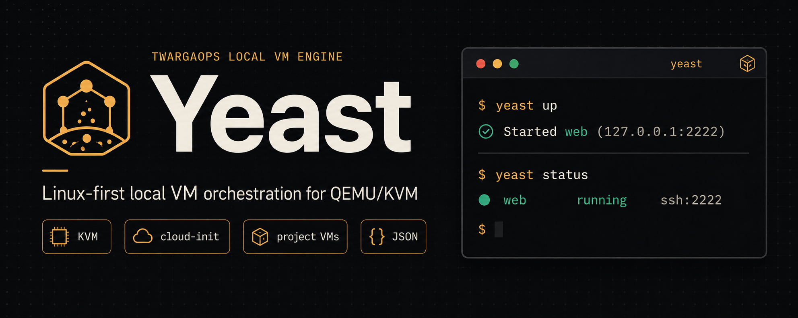

# Yeast

<div align="center">



<br />
<br />

**Linux-first local VM orchestration for QEMU/KVM**

Fast project-based virtual machines with cloud-init, trusted base images, SSH access, and clean JSON output.


[Quick Start](#quick-start) · [Current Scope](#current-scope) · [Commands](#commands) · [Examples](#examples) · [Architecture](#architecture) · [Limits](#current-limits)

</div>

---

## What Yeast Is

Yeast is the local VM engine for TwargaOps.

At the user level, Yeast gives you a simple model:

- define machines in `yeast.yaml`
- pull a trusted base image
- run `yeast up`
- connect with `yeast ssh`
- stop with `yeast down`
- clean up with `yeast destroy`

At the product level, Yeast is meant to become the foundation for:

- LabsBackery
- Yeast MCP
- future hosted Twarga Cloud workers

The important constraint for v0.1 is simple: **keep the core small and reliable before adding the larger ecosystem layers.**

---

## Current Scope

Yeast v0.1 is intentionally narrow. It focuses on one job: making local Linux VMs predictable enough to use as a base product.

| Area | v0.1 status |
|---|---|
| Host support | Linux only |
| Runtime | QEMU + KVM |
| VM model | Project-local instances from `yeast.yaml` |
| Base images | Trusted shared cache in `~/.yeast/cache/images` |
| Bootstrap | cloud-init seed ISO |
| Access | SSH over host port forwarding |
| State | Project-scoped state with locking and reconciliation |
| Automation | Stable `--json` output for core non-interactive commands |
| Examples | Single-VM Ubuntu example |

### What works now

- `yeast doctor`
- `yeast init`
- `yeast pull --list`
- `yeast pull <image>`
- `yeast up`
- `yeast status`
- `yeast ssh [instance]`
- `yeast down`
- `yeast destroy`
- `yeast version`

### What is not in v0.1 yet

- provisioning packages/files/shell workflows
- snapshots and restore
- multi-VM private lab networking
- guest exec/copy/logs
- templates
- daemon or web API
- Twarga Cloud features

---

## Table of Contents

- [Why It Exists](#why-it-exists)
- [Quick Start](#quick-start)
- [Install](#install)
- [Commands](#commands)
- [Config](#config)
- [Examples](#examples)
- [How Yeast Stores Data](#how-yeast-stores-data)
- [Architecture](#architecture)
- [Testing](#testing)
- [Current Limits](#current-limits)
- [Project Docs](#project-docs)
- [License](#license)

---

## Why It Exists

Running local VMs is still more painful than it should be for Linux builders.

The raw workflow usually means stitching together too many manual steps:

- downloading cloud images
- creating qcow2 disks
- generating cloud-init files
- building a seed ISO
- composing QEMU arguments
- tracking SSH ports
- remembering which runtime files belong to which project

Yeast reduces that to a project workflow instead of a pile of ad hoc commands.

It is not trying to be a cloud platform, a container system, or a Proxmox replacement. The v0.1 goal is much simpler: **make local real VMs feel project-native and repeatable.**

---

## Quick Start

### 1. Check the host

```bash
yeast doctor
```

Yeast needs:

- Linux
- `/dev/kvm`
- `qemu-system-x86_64`
- `qemu-img`
- `genisoimage` or `mkisofs`
- `ssh`
- `~/.ssh/id_ed25519.pub` or `~/.ssh/id_rsa.pub`

### 2. Create a project

```bash
mkdir my-lab
cd my-lab
yeast init
```

Default starter config:

```yaml
version: 1
instances:
  - name: web
    image: ubuntu-24.04
    memory: 1024
    cpus: 1
```

### 3. List supported images

```bash
yeast pull --list
```

Current trusted images:

- `ubuntu-22.04`
- `ubuntu-24.04`

### 4. Pull one image

```bash
yeast pull ubuntu-24.04
```

### 5. Start the project

```bash
yeast up
```

Expected human output:

```text
Started web (127.0.0.1:2222)
```

### 6. Check status

```bash
yeast status
```

Expected human output:

```text
web	running	127.0.0.1:2222
```

### 7. Connect

```bash
yeast ssh web
```

### 8. Stop or remove

```bash
yeast down
yeast destroy
```

---

## Install

### One-command install

If the repository is reachable over HTTPS:

```bash
curl -fsSL https://raw.githubusercontent.com/Twarga/yeast/main/install.sh | bash
```

If you already cloned the repo:

```bash
bash install.sh
```

The installer attempts to:

- detect the package manager
- install Yeast runtime dependencies
- install Go for source build flow
- clone and build Yeast
- install `yeast` into `/usr/local/bin`
- create the Yeast cache directory
- generate an SSH key if needed
- add the user to the `kvm` group when possible

### Build from source

```bash
git clone https://github.com/Twarga/yeast.git
cd yeast
go build -o yeast ./cmd/yeast
sudo mv yeast /usr/local/bin/
```

### Typical host packages

```bash
# Ubuntu / Debian
sudo apt install qemu-system-x86 qemu-utils genisoimage

# Fedora / RHEL
sudo dnf install qemu-system-x86 qemu-img genisoimage

# Arch Linux
sudo pacman -S qemu-base cdrtools
```

If needed:

```bash
sudo usermod -aG kvm $USER
```

Then log out and back in before your first `yeast up`.

---

## Commands

| Command | Purpose |
|---|---|
| `yeast doctor` | Check host readiness |
| `yeast init` | Create `yeast.yaml` and project metadata |
| `yeast pull --list` | List supported trusted images |
| `yeast pull <image>` | Download a trusted base image |
| `yeast up` | Start all instances in the project |
| `yeast status` | Show tracked instance state |
| `yeast ssh [instance]` | Open SSH into a running instance |
| `yeast down` | Stop tracked running instances |
| `yeast destroy` | Stop and remove tracked runtime data |
| `yeast version` | Print the current version |

### JSON mode

These commands support machine-readable output:

- `doctor`
- `init`
- `pull`
- `up`
- `status`
- `down`
- `destroy`
- `version`

Example:

```bash
yeast status --json
```

`yeast ssh` is interactive and should be treated as a terminal workflow, not a JSON workflow.

---

## Config

Current v0.1 example:

```yaml
version: 1
instances:
  - name: web
    image: ubuntu-24.04
    memory: 1024
    cpus: 1
    disk_size: 20G
    user: yeast
    sudo: none
    env:
      APP_ENV: development
```

### Supported instance fields

- `name`
- `image`
- `memory`
- `cpus`
- `disk_size`
- `user`
- `sudo`
- `env`
- `user_data`

### Important behavior

- `user_data` replaces Yeast-generated cloud-init instead of merging into it
- `disk_size` applies to the overlay disk Yeast creates for the instance
- `env` is rendered into the guest bootstrap profile script
- `networks` and `provision` exist in the config model for future milestones but are not active v0.1 features

---

## Examples

Current repo example:

- [examples/ubuntu-basic](examples/ubuntu-basic/README.md)

That example is intentionally small:

- one Ubuntu VM
- no provisioning
- no networking topology
- no snapshot logic

It exists to prove the real v0.1 path cleanly.

---

## How Yeast Stores Data

### In the project

- `yeast.yaml` — desired VM configuration
- `.yeast/project.json` — project identity metadata

### Under `~/.yeast`

- `cache/images/` — shared trusted base images
- `projects/<project-id>/state.json` — project runtime state
- `projects/<project-id>/state.lock` — project state lock
- `projects/<project-id>/instances/<name>/` — per-instance runtime files

Typical instance files:

- `disk.qcow2`
- `seed.iso`
- `user-data`
- `meta-data`
- `vm.log`

This separation is important. Two different projects can both have an instance named `web` without colliding.

---

## Architecture

Yeast is structured so the CLI is only one entrypoint, not the whole product.

```text
CLI
  -> app workflows
     -> config
     -> project paths
     -> state + locking
     -> image cache
     -> cloud-init
     -> runtime interface
        -> QEMU/KVM backend
```

That split matters because the long-term direction is larger than the local CLI:

- LabsBackery should call Yeast workflows, not reimplement VM logic
- Yeast MCP should depend on stable state and JSON output
- Twarga Cloud should eventually reuse the same engine model remotely

For the current detailed architecture document, see [YEAST_TECHNICAL_ARCHITECTURE.md](YEAST_TECHNICAL_ARCHITECTURE.md).

---

## Testing

Fast package suite:

```bash
bash scripts/test-fast.sh
```

Full suite:

```bash
go test ./... -count=1
go build ./...
```

The repo also includes fake-runtime workflow tests so core app flows can be validated without a real QEMU host.

---

## Current Limits

This README is intentionally honest about the current product shape.

Current known limits:

- Linux host only
- QEMU/KVM only
- no Windows or macOS host support
- no VirtualBox backend
- no snapshots yet
- no provisioning workflow yet
- no multi-VM networking yet
- no guest exec/copy/logs yet
- no daemon or remote worker mode yet
- no full LabsBackery contract yet

That is not a weakness in the README. It is the correct scope boundary for v0.1.

---

## Project Docs

- [YEAST_VISION.md](YEAST_VISION.md)
- [YEAST_TECHNICAL_DISCOVERY.md](YEAST_TECHNICAL_DISCOVERY.md)
- [YEAST_TECHNICAL_ARCHITECTURE.md](YEAST_TECHNICAL_ARCHITECTURE.md)
- [YEAST_V2_IMPLEMENTATION_PLAN.md](YEAST_V2_IMPLEMENTATION_PLAN.md)
- [YEAST_TEST_PLAN.md](YEAST_TEST_PLAN.md)
- [YEAST_RELEASE_PLAN.md](YEAST_RELEASE_PLAN.md)
- [YEAST_PRODUCT_ROADMAP.md](YEAST_PRODUCT_ROADMAP.md)
- [docs/quickstart.md](docs/quickstart.md)
- [docs/installation.md](docs/installation.md)
- [docs/config-reference.md](docs/config-reference.md)
- [docs/troubleshooting.md](docs/troubleshooting.md)
- [docs/known-limitations.md](docs/known-limitations.md)
- [docs/architecture-overview.md](docs/architecture-overview.md)
- [docs/charm-cli-plan.md](docs/charm-cli-plan.md)
- [TASKS.md](TASKS.md)

---

## License

MIT. See [LICENSE](LICENSE).
