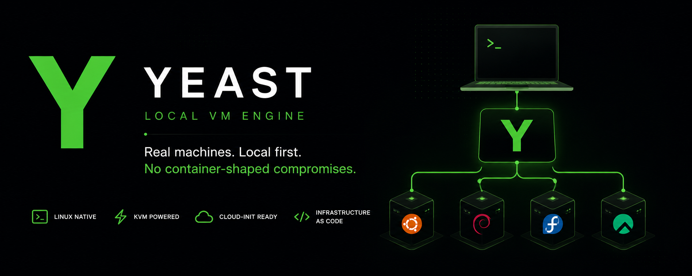

# Yeast

<div align="center">



<br />
<br />

**Linux-first local VM orchestration for QEMU/KVM**

Fast project-based virtual machines with cloud-init, trusted base images, post-boot provisioning, SSH access, stable JSON, and event streams.


[Website](https://twarga.github.io/yeast/) · [Quick Start](#quick-start) · [Current Scope](#current-scope) · [Commands](#commands) · [Examples](#examples) · [Architecture](#architecture) · [Limits](#current-limits)

</div>

---

## What Yeast Is

Yeast is the local VM engine for TwargaOps.

At the user level, Yeast gives you a simple model:

- define machines in `yeast.yaml`
- run `yeast up`
- let Yeast download supported images when needed
- connect with `yeast ssh`
- stop with `yeast down`
- clean up with `yeast destroy`

At the product level, Yeast is meant to become the foundation for:

- LabsBackery
- Yeast MCP
- future hosted Twarga Cloud workers

The important constraint is still simple: **keep the core small and reliable before adding the larger ecosystem layers.**

---

## Current Scope

Yeast `v1.1.2` is the current stable local engine release. It covers one complete loop: boot a VM, provision it into something useful, snapshot a clean baseline, restore it later, attach one private lab network, operate inside the guest through an SSH-backed control surface, start new projects from built-in or local templates, expose a versioned JSON/events contract for tools, and define the first LabsBakery integration boundary.

| Area | Current status |
|---|---|
| Host support | Linux native; WSL beta docs available |
| Runtime | QEMU + KVM |
| VM model | Project-local instances from `yeast.yaml` |
| Base images | Trusted shared cache in `~/.yeast/cache/images` |
| Bootstrap | cloud-init seed ISO |
| Access | SSH over host port forwarding |
| State | Project-scoped state with locking and reconciliation |
| Automation | Versioned `--json` envelopes, stable command data fields, documented error codes, and JSON Lines `--events` for lifecycle workflows |
| Provisioning | Packages, files, shell, and `yeast provision` |
| Reset | Stopped-VM snapshot, list, restore, and delete |
| Private networking | One project-level lab network with static per-instance IPv4 |
| Guest control | `exec`, `copy`, `logs`, and `inspect` |
| Templates | Built-in `ubuntu-basic`, `caddy-single-vm`, and `two-vm-lab`; local template directories |
| LabsBakery integration | Stable local-engine contract, lab package convention, and first attacker/target example package |
| Examples | Single-VM Ubuntu, Caddy provisioning/reset, first two-VM lab example, and LabsBakery package example |

If you are installing Yeast:

- [Install on Linux](docs/getting-started/installation-linux.md)
- [Install on Windows with WSL (beta)](docs/getting-started/installation-windows-wsl.md)

### What works now

- `yeast doctor`
- `yeast init`
- `yeast init --list-templates`
- `yeast init --template <name-or-path>`
- `yeast pull --list`
- `yeast pull <image>`
- `yeast up`
- post-boot provisioning during `yeast up`
- `yeast provision [instance]`
- `yeast snapshot <instance> <name>`
- `yeast restore <instance> <name>`
- `yeast snapshots <instance>`
- `yeast delete-snapshot <instance> <name>`
- `yeast status`
- `yeast exec [instance] -- <command...>`
- `yeast copy <instance> --to-guest <source> <destination>`
- `yeast copy <instance> --from-guest <source> <destination>`
- `yeast logs <instance>`
- `yeast inspect <instance>`
- `yeast ssh [instance]`
- `yeast down`
- `yeast destroy`
- `yeast version`
- first private lab network with per-instance `LAB IP`
- versioned `--json` output with `schema_version: "yeast.v1"`
- browser-terminal-friendly `user` metadata in `status --json` and `inspect --json`
- `--json --events` streams for `up`, `provision`, `restore`, `down`, and `destroy`
- LabsBakery integration contract docs
- LabsBakery lab package convention docs
- first Yeast-backed LabsBakery attacker/target example package

### What is not in the current release yet

- remote template downloads or registry search/update
- complex template variables
- daemon or web API
- Twarga Cloud features
- LabsBakery web UI
- packaged `.lbz` import/export
- project-wide atomic snapshot/reset helper
- multiple private networks
- bridge mode
- DHCP lab guests
- event history or progress percentages

---

## Table of Contents

- [Why It Exists](#why-it-exists)
- [Quick Start](#quick-start)
- [Install](#install)
- [Commands](#commands)
- [Config](#config)
- [Examples](#examples)
- [How Yeast Stores Data](#how-yeast-stores-data)
- [Architecture](#architecture)
- [Testing](#testing)
- [Current Limits](#current-limits)
- [Project Docs](#project-docs)
- [License](#license)

---

## Why It Exists

Running local VMs is still more painful than it should be for Linux builders.

The raw workflow usually means stitching together too many manual steps:

- downloading cloud images
- creating qcow2 disks
- generating cloud-init files
- building a seed ISO
- composing QEMU arguments
- tracking SSH ports
- remembering which runtime files belong to which project

Yeast reduces that to a project workflow instead of a pile of ad hoc commands.

It is not trying to be a cloud platform, a container system, or a Proxmox replacement. The current goal is still simple: **make local real VMs feel project-native and repeatable.**

---

## Quick Start

### 1. Check the host

```bash
yeast doctor
```

Yeast needs:

- Linux
- `/dev/kvm`
- `qemu-system-x86_64`
- `qemu-img`
- `genisoimage` or `mkisofs`
- `ssh`
- `~/.ssh/id_ed25519.pub` or `~/.ssh/id_rsa.pub`

### 2. Create a project

```bash
mkdir my-lab
cd my-lab
yeast init
```

Or start from a built-in template:

```bash
yeast init --list-templates
yeast init --template caddy-single-vm
```

Default starter config without a template:

```yaml
version: 1
instances:
  - name: web
    hostname: web-lab
    image: ubuntu-24.04
    memory: 1024
    cpus: 1
```

### 3. Review the generated config

```bash
sed -n '1,120p' yeast.yaml
```

The important fields are:

| Field | Meaning |
|---|---|
| `name` | VM name used by commands such as `yeast ssh web` |
| `image` | supported base image, for example `ubuntu-24.04` |
| `memory` | RAM in MiB |
| `cpus` | virtual CPU count |

### 4. Optional: list supported images

```bash
yeast pull --list
```

Yeast includes trusted image entries:

- Auto-downloadable cloud images: `ubuntu-24.04`, `ubuntu-22.04`, `debian-12`, `debian-13`, `fedora-42`, `fedora-41`, `rocky-9`, `alma-9`, and `centos-stream-9`
- Manual/setup-only image entries: `amazon-linux-2023`, `kali-2026.1`, `parrot-security-7.1`, `alpine-3.21`, `arch-linux`, `nixos-24.11`, and `opensuse-leap-15.6`

### 5. Start the project

```bash
yeast up
```

If the image is not cached yet, `yeast up` downloads supported cloud images automatically. Manual images print setup instructions instead of downloading.

If you want to warm the image cache before booting, use `yeast pull <image>`.

Expected human output shape includes progress lines and a final summary:

```text
  * [web] Pulling image...
  + [web] Image ready
  + [web] SSH ready

All instances ready
  NAME  STATUS   SSH             LAB IP
  web   running  127.0.0.1:2222

  Done in 34s
```

### 6. Check status

```bash
yeast status
```

Expected human output shape:

```text
Project status
  NAME  STATUS   SSH             LAB IP
  web   running  127.0.0.1:2222
```

### 7. Connect

```bash
yeast ssh web
```

### 8. Rerun provisioning

```bash
yeast provision web
```

### 9. Create a stopped-VM snapshot

```bash
yeast down
yeast snapshot web clean --description "Provisioned baseline"
yeast snapshots web
```

### 10. Restore that snapshot later

```bash
yeast up
yeast ssh web
# change something inside the guest
exit
yeast down
yeast restore web clean
yeast up
```

### 11. Use guest control

```bash
yeast exec web -- whoami
yeast copy web --to-guest ./artifact.txt /home/yeast/artifact.txt
yeast copy web --from-guest /home/yeast/artifact.txt ./artifact-out.txt
yeast inspect web
yeast logs web --tail 20
```

### 12. Try the first two-VM lab

Reference example:

```text
examples/two-vm-lab
```

That example shows:

- `attacker` and `target` VMs
- separate management SSH ports
- one private lab network
- static lab IPs visible in `yeast status`

### 13. Stop or remove

```bash
yeast down
yeast delete-snapshot web clean
yeast destroy
```

---

## Install

### One-command install

If the repository is reachable over HTTPS:

```bash
curl -fsSL https://raw.githubusercontent.com/Twarga/yeast/main/install.sh | bash
```

If you already cloned the repo:

```bash
bash install.sh
```

The installer attempts to:

- detect the package manager
- install Yeast runtime dependencies
- install Go for source build flow
- clone and build Yeast
- install `yeast` into `/usr/local/bin`
- verify the installed binary version
- create the Yeast cache directory
- generate an SSH key if needed
- leave `/dev/kvm` ownership unchanged unless `YEAST_FIX_KVM_PERMISSIONS=1` is set

### Build from source

```bash
git clone https://github.com/Twarga/yeast.git
cd yeast
go build -o yeast ./cmd/yeast
sudo mv yeast /usr/local/bin/
```

### Typical host packages

```bash
# Ubuntu / Debian
sudo apt install qemu-system-x86 qemu-utils genisoimage

# Fedora / RHEL
sudo dnf install qemu-system-x86 qemu-img genisoimage

# Arch Linux
sudo pacman -S qemu-base cdrtools
```

If needed:

```bash
sudo usermod -aG kvm $USER
```

Then log out and back in before your first `yeast up`.

---

## Commands

| Command | Purpose |
|---|---|
| `yeast doctor` | Check host readiness |
| `yeast init` | Create `yeast.yaml` and project metadata |
| `yeast init --list-templates` | List built-in project templates |
| `yeast init --template <name-or-path>` | Create a project from a built-in or local template |
| `yeast pull --list` | List supported trusted images |
| `yeast pull <image>` | Pre-cache an auto-download image or print setup instructions for manual images |
| `yeast up` | Start all instances in the project |
| `yeast provision [instance]` | Rerun post-boot provisioning for a running instance |
| `yeast status` | Show tracked instance state |
| `yeast exec [instance] -- <command...>` | Run one command inside a running instance |
| `yeast copy <instance> ...` | Copy a file to or from a running instance |
| `yeast logs <instance>` | Read the VM runtime log for one instance |
| `yeast inspect <instance>` | Show detailed state for one instance |
| `yeast ssh [instance]` | Open SSH into a running instance |
| `yeast down` | Stop tracked running instances |
| `yeast destroy` | Stop and remove tracked runtime data |
| `yeast version` | Print the current version |

### JSON mode

These commands support machine-readable output:

- `doctor`
- `init`
- `pull`
- `up`
- `status`
- `exec`
- `copy`
- `logs`
- `inspect`
- `down`
- `destroy`
- `version`

Example:

```bash
yeast status --json
```

`yeast ssh` is interactive and should be treated as a terminal workflow, not a JSON workflow.

---

## Config

Current example:

```yaml
version: 1
instances:
  - name: web
    hostname: web-lab
    image: ubuntu-24.04
    memory: 1024
    cpus: 1
    disk_size: 20G
    ssh_port: 2205
    user: yeast
    sudo: none
    env:
      APP_ENV: development
```

### Supported instance fields

- `name`
- `image`
- `memory`
- `cpus`
- `disk_size`
- `hostname`
- `ssh_port`
- `user`
- `sudo`
- `env`
- `user_data`

### Important behavior

- `user_data` replaces Yeast-generated cloud-init instead of merging into it
- `disk_size` applies to the overlay disk Yeast creates for the instance; existing disks are kept as-is
- `disk_size` accepts whole-number sizes with optional `K`, `M`, `G`, `T`, or `P` suffixes, such as `20G`, `25600M`, or raw bytes
- `hostname` controls the guest hostname written through cloud-init; if omitted, Yeast uses the instance `name`
- `ssh_port` overrides the host-side SSH forwarding port; if omitted, Yeast auto-allocates starting at `2222`
- `env` is rendered into the guest bootstrap profile script
- `provision` now supports packages, files, and shell steps during `yeast up` and `yeast provision`
- file provision `source` paths are resolved relative to the project root unless they are absolute
- one project-level private lab `networks` block is active
- guest-control commands are SSH-backed only and operate on one selected instance at a time
- templates are project starters only; after `yeast init --template`, the generated files are normal editable project files

---

## Examples

Built-in templates:

```bash
yeast init --list-templates
yeast init --template ubuntu-basic
yeast init --template caddy-single-vm
yeast init --template two-vm-lab
```

Current repo examples:

- [examples/ubuntu-basic](examples/ubuntu-basic/README.md)
- [examples/caddy-single-vm](examples/caddy-single-vm/README.md)
- [examples/two-vm-lab](examples/two-vm-lab/README.md)
- [examples/labsbackery-attacker-target-basic](examples/labsbackery-attacker-target-basic/README.md)

The templates and examples are intentionally small:

- `ubuntu-basic` keeps the lifecycle-only path minimal
- `caddy-single-vm` shows provisioning with packages, files, and shell
- `two-vm-lab` shows the first private lab network
- `labsbackery-attacker-target-basic` shows the first Yeast-backed LabsBakery lab package convention

They exist to prove the current shipped paths cleanly.

---

## How Yeast Stores Data

### In the project

- `yeast.yaml` — desired VM configuration
- `.yeast/project.json` — project identity metadata

### Under `~/.yeast`

- `cache/images/` — shared trusted base images
- `projects/<project-id>/state.json` — project runtime state
- `projects/<project-id>/state.lock` — project state lock
- `projects/<project-id>/instances/<name>/` — per-instance runtime files

Typical instance files:

- `disk.qcow2`
- `seed.iso`
- `user-data`
- `meta-data`
- `vm.log`

This separation is important. Two different projects can both have an instance named `web` without colliding.

---

## Architecture

Yeast is structured so the CLI is only one entrypoint, not the whole product.

```text
CLI
  -> app workflows
     -> config
     -> project paths
     -> state + locking
     -> image cache
     -> cloud-init
     -> runtime interface
        -> QEMU/KVM backend
```

That split matters because the long-term direction is larger than the local CLI:

- LabsBackery should call Yeast workflows, not reimplement VM logic
- Yeast MCP should depend on stable state and JSON output
- Twarga Cloud should eventually reuse the same engine model remotely

For the current detailed architecture document, see [YEAST_TECHNICAL_ARCHITECTURE.md](YEAST_TECHNICAL_ARCHITECTURE.md).

---

## Testing

Fast package suite:

```bash
bash scripts/test-fast.sh
```

Full suite:

```bash
go test ./... -count=1
go build ./...
```

The repo also includes fake-runtime workflow tests so core app flows can be validated without a real QEMU host.

---

## Current Limits

This README is intentionally honest about the current product shape.

Current known limits:

- Linux host only
- QEMU/KVM only
- no native Windows or macOS host support; WSL is beta only
- no VirtualBox backend
- some image entries are manual/setup-only and cannot be auto-downloaded
- snapshots are stopped-VM and per-instance only
- private networking supports one project-level lab network only
- guest control is SSH-backed and one instance at a time
- templates are project starters only
- no remote template downloads or registry workflow
- no daemon or remote worker mode yet
- full end-to-end VM smoke testing requires a host with writable `/dev/kvm`, QEMU tools, network access for image downloads, and enough time for cloud-init/SSH readiness
- first LabsBakery local-engine contract is documented, but LabsBakery itself is not part of Yeast

That is not a weakness in the README. It is the correct scope boundary for the current release line.

---

## Project Docs

Terminal docs are available directly from the CLI:

```bash
yeast docs
yeast docs --list
yeast docs quickstart
yeast docs installation
yeast docs release-smoke
```

- [YEAST_VISION.md](YEAST_VISION.md)
- [YEAST_TECHNICAL_DISCOVERY.md](YEAST_TECHNICAL_DISCOVERY.md)
- [YEAST_TECHNICAL_ARCHITECTURE.md](YEAST_TECHNICAL_ARCHITECTURE.md)
- [YEAST_V2_IMPLEMENTATION_PLAN.md](YEAST_V2_IMPLEMENTATION_PLAN.md)
- [YEAST_TEST_PLAN.md](YEAST_TEST_PLAN.md)
- [YEAST_RELEASE_PLAN.md](YEAST_RELEASE_PLAN.md)
- [YEAST_PRODUCT_ROADMAP.md](YEAST_PRODUCT_ROADMAP.md)
- [docs/index.md](docs/index.md)
- [docs/getting-started/quickstart.md](docs/getting-started/quickstart.md)
- [docs/getting-started/installation.md](docs/getting-started/installation.md)
- [docs/reference/commands.md](docs/reference/commands.md)
- [docs/reference/yeast-yaml.md](docs/reference/yeast-yaml.md)
- [docs/reference/images.md](docs/reference/images.md)
- [docs/reference/v1.1-feature-map.md](docs/reference/v1.1-feature-map.md)
- [docs/concepts/networking.md](docs/concepts/networking.md)
- [docs/concepts/provisioning.md](docs/concepts/provisioning.md)
- [docs/concepts/snapshots.md](docs/concepts/snapshots.md)
- [docs/reference/limitations.md](docs/reference/limitations.md)
- [docs/troubleshooting/index.md](docs/troubleshooting/index.md)
- [docs/labs/index.md](docs/labs/index.md)
- [docs/labs/01-first-vm-first-ssh.md](docs/labs/01-first-vm-first-ssh.md)
- [docs/labs/04-status-logs-inspect-json.md](docs/labs/04-status-logs-inspect-json.md)
- [docs/labs/06-multi-vm-private-networking.md](docs/labs/06-multi-vm-private-networking.md)
- [docs/labs/07-templates-and-reusable-labs.md](docs/labs/07-templates-and-reusable-labs.md)
- [CHANGELOG.md](CHANGELOG.md)
- [TASKS.md](TASKS.md)

---

## License

MIT. See [LICENSE](LICENSE).
