# Yeast Product Roadmap And Strategy

Status: Draft v1  
Owner: Twarga / TwargaOps  
Date: 2026-05-14  
Document type: Technical product roadmap, PRD, and founder strategy document

## 1. Executive Summary

Yeast is the infrastructure engine for TwargaOps. It is a Linux-first local VM orchestrator built around QEMU/KVM and cloud-init. The short explanation is that Yeast lets a user describe machines in a project file, then Yeast creates, starts, provisions, controls, snapshots, resets, and destroys those machines in a predictable way.

The deeper explanation is that Yeast is not only a Vagrant alternative. Vagrant is the comparison people will understand quickly, but Yeast should become a modern engine for repeatable local infrastructure, cybersecurity labs, AI-controlled VM workflows, and eventually hosted Twarga Cloud workers.

The product direction is:

- Yeast starts as a simple local VM tool for Linux users.
- Yeast becomes reliable enough to replace Vagrant-style workflows for TwargaOps.
- Yeast adds provisioning so machines become useful automatically.
- Yeast adds snapshots and reset so labs become reusable.
- Yeast adds multi-VM networking so cybersecurity labs become realistic.
- Yeast adds guest control commands so LabsBackery and Yeast MCP can automate VMs.
- Yeast exposes stable JSON and events so other products can build on it safely.
- Yeast eventually powers remote workers for Twarga Cloud.

The product promise is:

Yeast should make real Linux VMs feel project-native, repeatable, automatable, and understandable.

### Ecosystem Map

This diagram shows why Yeast matters beyond the CLI. Yeast is the low-level engine. The other TwargaOps products use that engine in different ways.

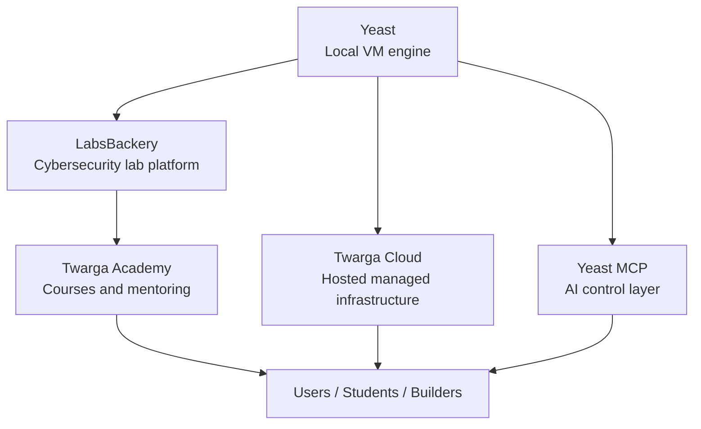

The important idea is that Yeast should stay focused. It does not need to become the course platform, the AI product, or the cloud business by itself. It needs to be strong enough that those products can trust it.

## 2. Product Definition

Yeast is a project-based VM orchestration tool.

A user creates or enters a project folder. Inside that folder, the user has a Yeast configuration. The configuration says which machines should exist, which images they use, how much memory and CPU they need, how they are networked, and how they should be prepared. Yeast then turns that desired configuration into actual running VMs.

Yeast should be easy enough for one developer to use from a terminal, but structured enough that LabsBackery, Yeast MCP, and Twarga Cloud can use it as an engine.

Yeast should not feel like a random wrapper around QEMU. It should feel like a product with a clear mental model:

- Config describes what should exist.
- State records what actually exists.
- Runtime executes VM operations.
- Provisioning prepares the operating system.
- Guest control operates inside machines.
- Output explains what happened to humans and tools.

### Core Product Loop

Yeast should always feel like a loop from intention to reality.

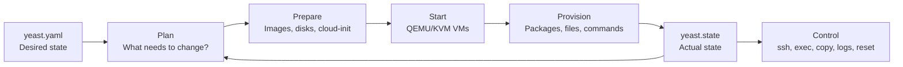

This is the mental model you should be able to explain. The user describes what they want. Yeast checks what exists. Yeast performs the missing work. Yeast records the result. Then users and tools control the machines.

## 3. The Problem

Local VM workflows are still too painful for the kind of ecosystem TwargaOps wants to build.

If someone wants to create a useful local VM today, they often need to understand many separate pieces:

- Where to download a trusted cloud image.
- How to create a qcow2 disk.
- How to generate cloud-init files.
- How to create a seed ISO.
- How to start QEMU with the right flags.
- How to forward SSH ports.
- How to know when the VM is ready.
- How to stop the VM safely.
- How to reset the VM after it breaks.
- How to connect multiple VMs together.
- How to expose the workflow to a web UI or AI agent.

Vagrant solved some of this historically, but it now feels heavy, older, provider-dependent, and not designed around modern AI and lab workflows. Vagrant is still useful as a reference, but Yeast should own the TwargaOps stack instead of depending on Vagrant.

For LabsBackery, this problem is even stronger. A cybersecurity lab does not need only one blank VM. It needs repeatable multi-VM environments with attacker machines, target machines, private networks, vulnerable apps, snapshots, resets, and terminals.

For Yeast MCP, the problem is also stronger. An AI agent cannot use a VM product well if the VM product only starts machines. The agent needs inspect, execute, copy, logs, status, and reset operations with stable machine-readable responses.

## 4. Target Users

### Primary User: Linux Builder

This user is a developer, DevOps learner, homelab user, or infrastructure builder using Linux as the main environment. They want real VMs, not containers, because they need kernel-level behavior, system services, networking practice, isolation, or realistic OS workflows.

They need Yeast to be simple:

- Define a VM.
- Start it.
- SSH into it.
- Stop it.
- Destroy it.

Their main pain is setup complexity. They do not want to manually write QEMU commands or cloud-init files.

### Primary User: Cybersecurity Lab Builder

This user creates labs for themselves, students, a course, or a classroom. They need machines that can be broken and reset. They care about realism and repeatability.

They need Yeast to support:

- Multiple VMs in one project.
- Private networks.
- Static IPs.
- Provisioning per machine role.
- Snapshot baselines.
- Reset workflows.
- JSON status for a UI.

LabsBackery is the product built for this user, but Yeast must provide the engine.

### Primary User: TwargaOps Founder / Maintainer

This is you. You need Yeast to be understandable, maintainable, and explainable. You need to believe in the architecture. You need to use Yeast as the foundation for other projects without feeling that the base is fragile.

Your needs are:

- Clean architecture.
- Clear scope.
- Versioned roadmap.
- Stable concepts.
- Strong documentation.
- A product story that connects Yeast, LabsBackery, Yeast MCP, and Twarga Cloud.

### Secondary User: AI Agent / Yeast MCP

This is not a human user, but it is a product user. Yeast MCP will need to call Yeast operations safely and understand the results.

It needs:

- Stable JSON.
- Stable error codes.
- Commands that do one clear thing.
- Guest operations like exec, copy, logs, inspect, snapshot, and restore.
- Predictable state.

### Secondary User: Future Twarga Cloud Customer

This user may never install Yeast locally. They will use LabsBackery or Twarga Cloud from a browser. But behind the scenes, Yeast workers will start and manage their lab machines.

They need:

- Fast lab startup.
- Reliable reset.
- Secure isolation.
- Clear resource limits.
- Browser terminal access.
- Managed convenience.

## 5. Product Positioning

Yeast should be positioned as:

Modern Linux-first VM orchestration for local labs, automation, and AI-controlled infrastructure workflows.

Short version:

Yeast is a modern Linux-first alternative to Vagrant, built for QEMU/KVM, cloud-init, labs, and automation.

Founder version:

Yeast is the infrastructure engine of TwargaOps. It starts as a local VM orchestrator, but its full purpose is to power LabsBackery, Yeast MCP, and eventually Twarga Cloud.

What makes Yeast different:

- Linux-first instead of trying to support everything equally.
- QEMU/KVM-first instead of VirtualBox-first.
- Cloud-init-native instead of plugin-heavy provisioning first.
- JSON and event-friendly from the start.
- Designed for cybersecurity labs and AI workflows.
- Built as an engine for other TwargaOps products, not only a standalone CLI.

## 6. What Yeast Is Not

Yeast is not a full cloud platform in v1.

Yeast is not Kubernetes.

Yeast is not a container orchestrator.

Yeast is not a replacement for every hypervisor manager.

Yeast is not trying to become Proxmox.

Yeast is not trying to support Windows and macOS as equal first-class hosts immediately.

Yeast is not a full cybersecurity platform by itself. LabsBackery is the lab product. Yeast is the VM engine.

Yeast is not an AI product by itself. Yeast MCP is the AI control layer. Yeast provides the stable operations MCP needs.

## 7. Product Principles

### Principle 1: Boring Core, Powerful Composition

Yeast itself should be boring infrastructure plumbing. It should be reliable, understandable, and predictable. The exciting products should be built on top: LabsBackery, Yeast MCP, and Twarga Cloud.

If the core is boring and strong, the ecosystem can become powerful.

### Principle 2: Human-Friendly And Machine-Friendly

Yeast has two audiences:

- Humans using the terminal.
- Tools using JSON and events.

The terminal output should be readable. The JSON output should be stable. One should not destroy the other.

### Principle 3: Project-Based Mental Model

The user should think in projects, not global VMs.

A project contains a Yeast config. Yeast manages the machines for that project. This is closer to how developers and lab builders think.

### Principle 4: Desired State And Actual State

Yeast should always compare what the user wants with what actually exists.

The config is desired state. The state file is actual state. Commands move actual state closer to desired state.

This makes Yeast feel like infrastructure software instead of a pile of scripts.

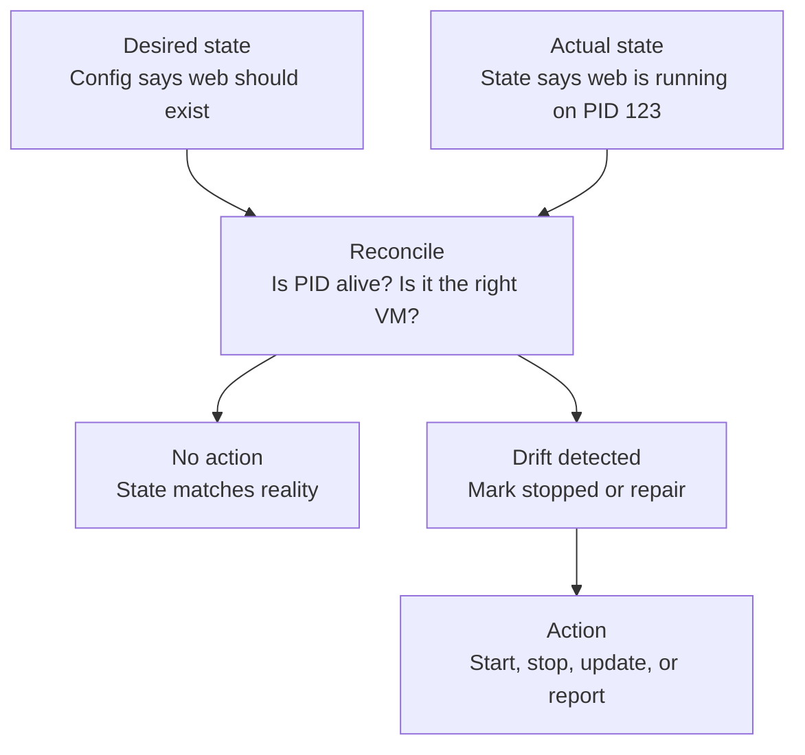

This matters because a local VM tool must handle messy reality. A user can kill QEMU manually. A port can be busy. A machine can fail to boot. Yeast should not blindly trust old state.

### Principle 5: Labs Need Reset

Cybersecurity labs are meant to be broken. If reset is not first-class, LabsBackery will be weak. Snapshots and restore are not optional long-term features. They are core lab primitives.

### Principle 6: AI Needs Structured Control

AI agents cannot work reliably through messy human-only output. Yeast must offer stable machine-readable status, command results, logs, and errors.

### Principle 7: Do Not Build Cloud Too Early

Twarga Cloud is a monetization path, but it should not be built before Yeast is reliable locally. The local engine proves the model. The cloud version sells convenience later.

## 8. Core Concepts

### Project

A project is the folder Yeast operates in. It contains the user-facing configuration and usually represents one app, one lab, one experiment, or one environment.

For the user, the project is the world. They do not want VMs from different folders mixing together.

### Instance

An instance is one VM inside a project. Examples: web, db, attacker, target, monitor.

An instance has resources, image, disk, networking, provisioning, and runtime state.

### Image

An image is a trusted base operating system disk, usually a cloud image. Yeast stores images in a shared cache so projects do not redownload the same base image repeatedly.

### Disk

A disk is the writable VM storage created from a base image. The base image should stay clean. The instance disk contains the project-specific changes.

### State

State records what Yeast believes exists right now. It includes things like instance status, PID, SSH port, project identity, runtime paths, provisioning status, and eventually snapshot information.

State is not the source of desired configuration. It is the record of actual runtime reality.

### Runtime

The runtime is the component that talks to the VM backend. In the first serious version, this is QEMU/KVM. Later, Yeast may support other runtimes, but QEMU/KVM is the core.

### Provisioning

Provisioning turns a clean OS into a useful machine. It can install packages, copy files, write config, run commands, start services, and verify setup.

### Network

A network connects instances. Yeast needs management networking for SSH/control and lab networking for VM-to-VM traffic.

### Snapshot

A snapshot is a saved machine state. Labs use snapshots to return to a clean baseline after a student or test breaks the machine.

### Guest Control

Guest control means operations inside the VM, such as running commands, copying files, reading logs, or checking services.

### Concept Relationship Diagram

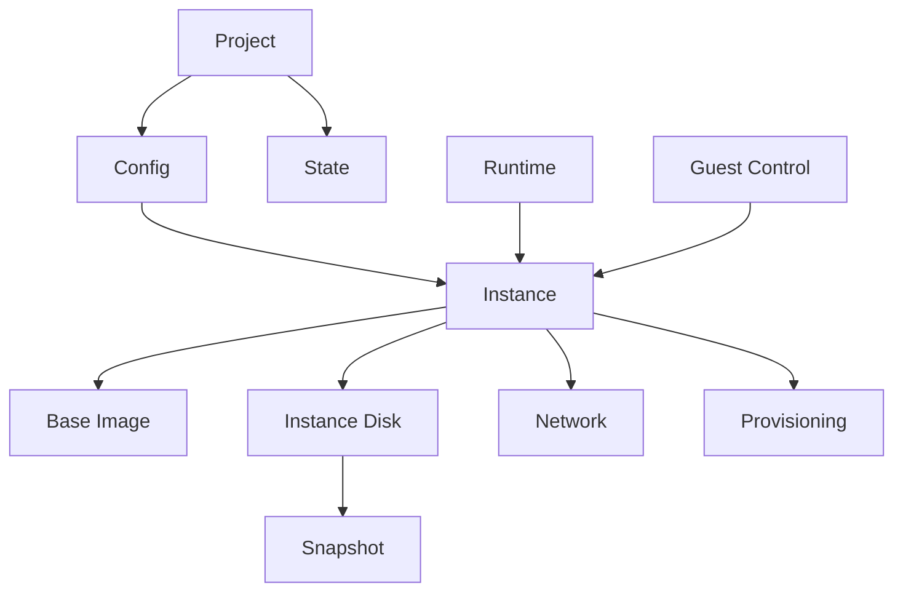

The important relationship is that the project owns the user intent and runtime state. Instances are the machines. Images are clean bases. Disks are writable project-specific machines. Networks connect machines. Provisioning prepares machines. Snapshots make machines recoverable. Guest control lets users and tools operate inside machines.

## 9. Architecture Model

The architecture should separate responsibilities clearly.

### Architecture Layer Diagram

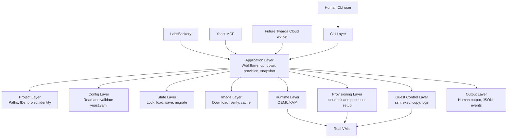

This is the architecture direction. The CLI is only one entrance. LabsBackery, Yeast MCP, and Twarga Cloud should eventually use the same application workflows instead of reimplementing VM logic.

### CLI Layer

The CLI receives commands from humans. It parses arguments and flags. It should not own business logic. It should call the application layer.

Good CLI behavior means the command files stay small and understandable.

### Application Layer

The application layer owns workflows. Examples: Up, Down, Destroy, Status, Provision, Snapshot, Restore, Exec.

This is the heart of Yeast. It coordinates config, state, runtime, provisioning, and output.

### Project Layer

The project layer understands where Yeast is running, how to identify the project, and where project runtime files should live.

This layer prevents collisions between projects.

### Config Layer

The config layer reads and validates Yeast configuration. It should catch bad config early and explain the problem clearly.

### State Layer

The state layer safely loads, locks, updates, migrates, and saves project state.

This layer must be conservative because bad state handling can create broken VMs or confusing status.

### Image Layer

The image layer downloads, verifies, caches, and lists base images.

This layer creates trust. Users should know images are expected and verified.

### Runtime Layer

The runtime layer handles QEMU/KVM details. It creates disks, starts processes, stops processes, manages snapshots, and eventually handles networking backends.

Only this layer should need deep QEMU knowledge.

### Provisioning Layer

The provisioning layer prepares machines. It should support cloud-init first and post-boot provisioning later.

This layer makes Yeast useful beyond blank machines.

### Guest Control Layer

The guest control layer talks to VMs after they are reachable. It powers exec, copy, logs, inspect, and health checks.

LabsBackery and Yeast MCP depend heavily on this layer.

### Output Layer

The output layer renders human output and JSON output from the same workflow events.

This prevents two separate products from existing inside one CLI.

### `yeast up` Lifecycle Diagram

```mermaid
sequenceDiagram
    participant User
    participant CLI
    participant App
    participant Config
    participant State
    participant Image
    participant Runtime
    participant Provision
    participant Guest

    User->>CLI: yeast up
    CLI->>App: Up(project)
    App->>Config: Load yeast.yaml
    App->>State: Lock and load state
    App->>Image: Verify image exists
    App->>Runtime: Create or resize disk
    App->>Provision: Generate cloud-init seed
    App->>Runtime: Start QEMU/KVM
    App->>Guest: Wait for SSH
    App->>Provision: Run post-boot setup
    App->>State: Save running instance state
    App->>CLI: Result and events
    CLI->>User: Human or JSON output
```

This diagram is the simplest operational explanation of Yeast. The user sees one command, but Yeast coordinates config, state, images, runtime, provisioning, and guest readiness.

### Storage Layout Diagram

Yeast needs project-safe storage so different projects do not collide.

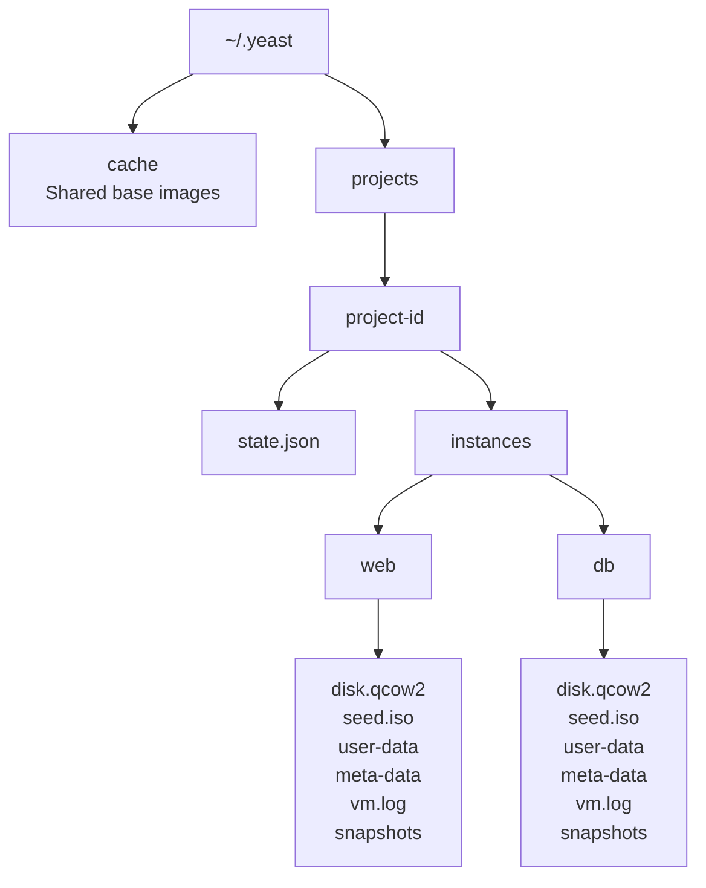

The point of this layout is safety. Two projects can both have a VM named `web`, but their runtime files stay separate because each project has its own identity.

## 10. Roadmap Overview

The recommended roadmap is:

- v0.1: Basic VM lifecycle.
- v0.2: Project safety and architecture.
- v0.3: Provisioning.
- v0.4: Snapshots and reset.
- v0.5: Multi-VM lab networking.
- v0.6: Guest control.
- v0.7: Templates.
- v0.8: Stable JSON and events.
- v0.9: LabsBackery-ready engine.
- v1.0: Stable public release.
- v2.0: Cloud and remote future.

The order matters. Yeast should not jump to cloud or AI before the local engine is reliable. LabsBackery and Yeast MCP depend on strong lower layers.

### Roadmap Dependency Diagram

```mermaid
flowchart LR
    V01["v0.1\nLifecycle"]
    V02["v0.2\nProject safety"]
    V03["v0.3\nProvisioning"]
    V04["v0.4\nSnapshots/reset"]
    V05["v0.5\nMulti-VM networking"]
    V06["v0.6\nGuest control"]
    V07["v0.7\nTemplates"]
    V08["v0.8\nJSON/events"]
    V09["v0.9\nLabsBackery-ready"]
    V10["v1.0\nStable release"]
    V20["v2.0\nCloud/remote"]

    V01 --> V02
    V02 --> V03
    V03 --> V04
    V04 --> V05
    V05 --> V06
    V06 --> V07
    V07 --> V08
    V08 --> V09
    V09 --> V10
    V10 --> V20
```

The roadmap is not ordered by what sounds coolest. It is ordered by what each later product needs from the layer below it.

## 11. Version Scope

### Yeast v0.1: Basic VM Lifecycle

Goal: prove Yeast can reliably manage simple project VMs.

This version is the trust foundation. A user should be able to create a config, pull an image, start a VM, SSH into it, stop it, and destroy it.

Features:

- `yeast init`: creates a starter project config so the user does not begin from an empty file.
- `yeast doctor`: checks if the machine can run Yeast before the user wastes time debugging.
- `yeast pull`: downloads trusted base images so VMs can be created quickly and safely.
- `yeast up`: starts the VMs described in the project.
- `yeast status`: shows what is running, stopped, or missing.
- `yeast ssh`: opens a shell inside a VM without making the user remember ports.
- `yeast down`: stops the project VMs without deleting their disks.
- `yeast destroy`: removes VM files when the user wants a clean project.
- Basic JSON output: lets scripts and future tools read Yeast output.
- State locking: prevents two Yeast commands from breaking the same project at once.

User value:

The user gets the first version of the promise: real VMs without manual QEMU setup.

Success criteria:

- A clean Ubuntu VM can be started and reached by SSH.
- Status is accurate after start, stop, and external process death.
- Destroy removes runtime files safely.
- Doctor gives clear fixes for missing dependencies.
- Pull verifies images.

Risks:

- QEMU/KVM host differences may cause confusing failures.
- SSH readiness can be flaky if cloud-init takes too long.
- State can become stale if processes die unexpectedly.

### Yeast v0.2: Project Safety And Architecture

Goal: make Yeast safe to use across many projects and clean enough to extend.

This version may not look exciting to users, but it is one of the most important releases. It prevents future mess.

Features:

- Project ID system: lets different projects use the same VM names without conflicts.
- Project-specific runtime folders: keeps every project's disks, logs, and state separated.
- Cleaner state model: makes status and recovery more reliable.
- State migrations: lets Yeast upgrade old project state safely.
- Thin CLI commands: makes commands easier to maintain and less fragile.
- Application service layer: centralizes the real workflows behind the CLI.
- QEMU runtime abstraction: keeps QEMU details hidden so Yeast can grow later.
- Better error codes: helps users and tools understand exactly what failed.
- Better human output: makes Yeast easier to read in the terminal.
- Better process reconciliation: avoids lying about VMs that died outside Yeast.

User value:

The user can trust Yeast across multiple projects. The founder can trust the architecture enough to keep building.

Success criteria:

- Two projects can both have an instance named web without collision.
- Runtime paths are predictable and project-scoped.
- Commands still work after internal restructuring.
- Errors are easier to understand.

Risks:

- Migration from old paths can break existing users if not handled carefully.
- Architecture work can become endless if not tied to real outcomes.

### Yeast v0.3: Provisioning

Goal: turn VMs from blank machines into useful machines.

Provisioning is the feature that makes Yeast a real alternative to Vagrant-style workflows. Without it, users still need to SSH manually and install everything themselves.

Features:

- `provision.packages`: installs required packages automatically.
- `provision.files`: copies app or lab files into the VM.
- `provision.shell`: runs setup commands inside the VM.
- Cloud-init provisioning: prepares the VM during first boot.
- Post-boot SSH provisioning: finishes setup after the VM becomes reachable.
- `yeast provision`: reruns setup without recreating the VM.
- Retry failed provisioning: helps users recover from temporary errors.
- Provisioning status: shows whether the VM is only booted or fully ready.
- Provisioning logs: helps debug failed installs or setup scripts.
- Basic idempotency rules: makes repeated provisioning safer.

User value:

The user can ask for Ubuntu plus Caddy plus their app, and Yeast can create that automatically.

LabsBackery value:

Labs can define attacker, target, and monitor roles. Each machine can become ready for the exercise without manual work.

Success criteria:

- A web VM can install a package, receive a file, run setup commands, and become ready.
- Provision failures are visible and recoverable.
- Re-running provisioning is predictable enough for real use.

Risks:

- Provisioning can become too complex if Yeast tries to replace Ansible too early.
- Shell scripts can be unsafe or non-idempotent.
- Cloud-init and SSH provisioning can overlap in confusing ways if not designed clearly.

#### Provisioning Flow Diagram

Provisioning has two phases. First-boot provisioning prepares the machine while it boots. Post-boot provisioning finishes setup after SSH is reachable.

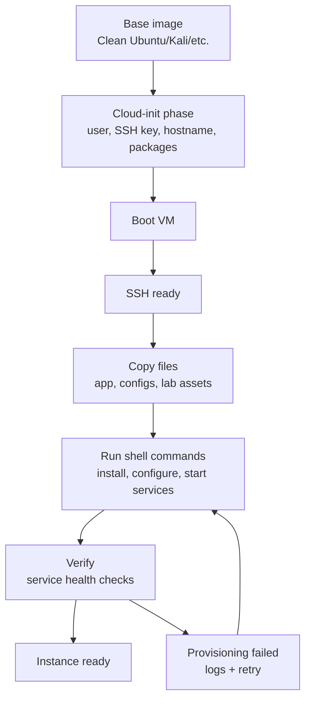

For the user, this means Yeast should not only boot Ubuntu. It should boot Ubuntu, prepare the app or lab, verify it, and tell the user whether the machine is actually ready.

### Yeast v0.4: Snapshots And Reset

Goal: make labs reusable and recoverable.

Cybersecurity labs are meant to be broken. A student may delete files, break services, change passwords, or corrupt app state. Reset must be a first-class product capability.

Features:

- `yeast snapshot`: saves a VM state at a known good moment.
- `yeast restore`: brings a VM back to a saved state.
- `yeast snapshots`: lists saved restore points.
- `yeast delete-snapshot`: removes old restore points.
- Snapshot all VMs: saves the whole project or lab at once.
- Restore all VMs: resets the whole project or lab at once.
- Safe stop-before-restore: protects VM disks from corruption.
- Snapshot metadata: records what each snapshot is and when it was made.
- Clean lab baseline snapshots: creates a reusable starting point for labs.
- Reset workflow for LabsBackery: gives students a simple reset lab button.

User value:

The user can experiment without fear. If the VM breaks, they can restore it.

LabsBackery value:

Every lab can have a clean baseline. Students can reset instead of reinstalling everything.

Success criteria:

- A VM can be provisioned, snapshotted, modified, restored, and verified.
- Multi-VM restore is predictable.
- Restore does not corrupt disks.

Risks:

- Snapshot strategy can become technically tricky.
- Restoring running VMs incorrectly can damage data.
- Snapshot storage can grow quickly.

#### Snapshot And Reset Flow Diagram

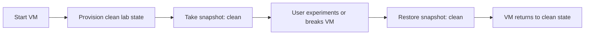

This is the heart of LabsBackery. A lab becomes useful when it can be broken and restored without rebuilding everything from zero.

### Yeast v0.5: Multi-VM Lab Networking

Goal: support realistic labs with machines that talk to each other.

Single VM workflows are useful, but LabsBackery needs topologies. Cybersecurity labs need attacker machines, target machines, monitoring machines, and predictable private IPs.

Features:

- Project-level networks: lets the user define networks once for the whole lab.
- Private VM-to-VM networks: lets VMs talk to each other without exposing everything to the host network.
- Static private IPs: gives predictable addresses for labs and tutorials.
- Separate management network: keeps Yeast control access separate from lab traffic.
- Per-instance network config: lets each VM connect to the networks it needs.
- Network validation: catches bad network configs before boot.
- Multi-VM topology support: makes attacker, target, and monitor lab layouts possible.
- Bridge mode improvement: lets advanced users connect VMs to a real LAN.
- Guest IP tracking: shows users where each VM can be reached.
- LabsBackery-ready networking: gives the visual lab builder a real backend.

User value:

The user can create realistic environments instead of isolated machines.

LabsBackery value:

LabsBackery can draw and run real lab topologies.

Success criteria:

- Two VMs can communicate on a private network.
- Static IPs are predictable.
- Yeast can still control machines through a management path.
- Labs can be started and reset without losing topology.

Risks:

- Networking is complex across Linux distributions.
- Static IP assignment needs clear guest configuration.
- Bridge mode can be host-specific and hard to support cleanly.

#### Multi-VM Lab Network Diagram

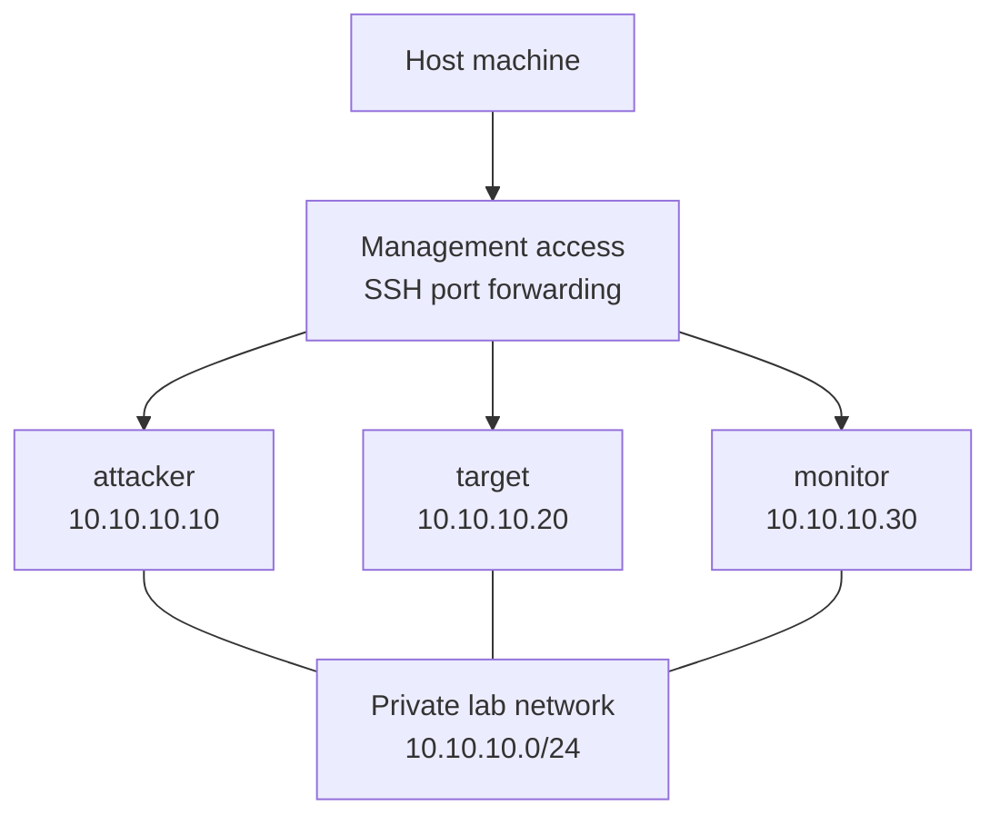

The management path is for Yeast to control machines. The private lab network is for the exercise. Keeping these separate makes labs easier to reason about.

### Yeast v0.6: Guest Control

Goal: let users and tools operate inside running VMs.

Starting a VM is not enough. LabsBackery and Yeast MCP need to inspect machines, run commands, copy files, and read logs.

Features:

- `yeast exec`: runs a command inside a VM from the host.
- `yeast copy`: moves files between host and VM.
- `yeast logs`: shows VM logs without hunting through folders.
- `yeast inspect`: shows detailed VM information.
- Command exit codes: tells scripts if a VM command succeeded or failed.
- Structured stdout and stderr in JSON: lets tools read command results cleanly.
- File upload: sends configs, scripts, or apps into a VM.
- File download: pulls reports, logs, or lab outputs back from a VM.
- Service health checks: verifies whether installed services actually work.
- MCP-ready operations: gives AI agents safe basic actions inside VMs.

User value:

The user can automate VM operations without manually SSHing every time.

Yeast MCP value:

AI agents get reliable primitives to inspect and fix machines.

Success criteria:

- Commands run inside a VM and return clear results.
- Files can move in both directions.
- Logs are easy to access.
- JSON output is structured and stable enough for tools.

Risks:

- Security boundaries must be clear because exec is powerful.
- SSH failures must be handled cleanly.
- Large file copies need timeouts and progress later.

### Yeast v0.7: Templates

Goal: make common environments reusable.

Once Yeast can create useful environments, users should not start from scratch every time. Templates make Yeast easier to adopt and make LabsBackery easier to build.

Features:

- `yeast init --template`: starts from a ready-made project instead of a blank config.
- Local templates: lets users keep reusable templates on their machine.
- Remote templates: lets users pull templates from a shared source.
- Template variables: lets one template be customized for different projects.
- Template validation: checks that a template is usable before running it.
- Template metadata: explains what the template is for and what it needs.
- App templates: quick starts for common stacks like Caddy or Docker.
- Cybersecurity lab templates: reusable attacker and target lab setups.
- Provisioning bundles: reusable setup steps for common VM roles.
- LabsBackery foundation: lets LabsBackery offer ready-to-run labs.

User value:

The user can start from a known good environment instead of writing everything manually.

Business value:

Templates become the bridge between open-source tooling, courses, LabsBackery, and Twarga Academy.

Success criteria:

- A user can initialize a Caddy web VM template.
- A user can initialize a two-VM lab template.
- Templates are understandable and editable.

Risks:

- Template systems can become too complicated.
- Remote templates raise trust and security questions.
- Versioning templates will matter later.

### Yeast v0.8: Stable JSON And Events

Goal: make Yeast dependable as an engine for other products.

LabsBackery and Yeast MCP need more than human output. They need structured progress, stable schemas, and predictable errors.

Features:

- Stable JSON schemas: lets external tools depend on Yeast output.
- Stable error codes: makes failures easier to handle automatically.
- Event stream for lifecycle actions: shows progress step by step.
- Machine-readable progress: lets UIs display real progress instead of guessing.
- Human output renderer: keeps terminal output clean for people.
- JSON output renderer: keeps automation output clean for tools.
- LabsBackery UI events: lets LabsBackery show live lab startup progress.
- MCP-friendly responses: makes Yeast easier for AI agents to use.
- Versioned API schemas: avoids breaking integrations unexpectedly.
- Automation guarantees: makes Yeast safe to build other products on.

User value:

Humans get better progress. Tools get reliable integration points.

Ecosystem value:

This is what turns Yeast from a CLI into a platform component.

Success criteria:

- LabsBackery can show live status without scraping terminal text.
- Yeast MCP can parse command results reliably.
- Breaking JSON changes are versioned or avoided.

Risks:

- Stable schemas require discipline.
- Bad schema design can lock Yeast into awkward shapes.

### Yeast v0.9: LabsBackery-Ready Engine

Goal: prove Yeast can power a real cybersecurity lab product.

This version is an integration milestone. It is not just adding features. It is testing whether the features work together as an engine.

Features:

- Multi-VM lab lifecycle: starts, stops, and resets whole labs.
- Lab start, stop, and reset workflows: maps directly to LabsBackery buttons.
- Lab template support: lets LabsBackery offer prebuilt exercises.
- Snapshot baseline support: gives every lab a clean restore point.
- Private lab networks: supports realistic cybersecurity practice.
- Per-VM provisioning: gives each VM its own role and setup.
- Web-terminal-friendly SSH info: lets LabsBackery open browser terminals.
- JSON status for UI: lets LabsBackery know what every VM is doing.
- Reliable cleanup: prevents broken lab files from piling up.
- Tested example labs: proves the engine works in real training scenarios.

User value:

Labs become product-ready instead of only terminal experiments.

Business value:

This version creates the technical foundation for courses, LabsBackery, and eventually hosted labs.

Success criteria:

- One complete lab can run through LabsBackery using Yeast.
- The lab can start, provision, snapshot, reset, and destroy.
- The UI can understand status and progress.

Risks:

- LabsBackery may expose missing Yeast features.
- Multi-VM lifecycle can reveal timing problems.
- Reset and networking must be reliable enough for students.

#### LabsBackery Integration Diagram

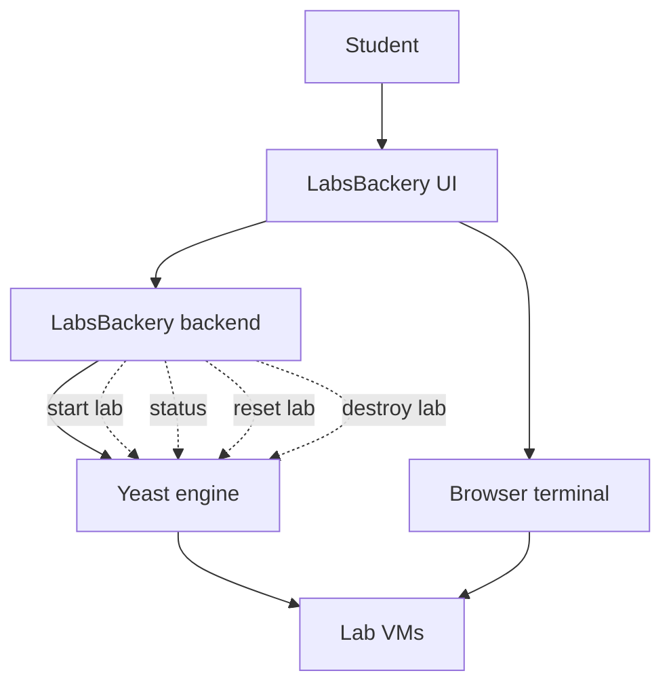

LabsBackery should not know how to start QEMU directly. It should ask Yeast for lab operations and show the result to the student.

### Yeast v1.0: Stable Public Release

Goal: make Yeast stable enough for real users and dependent products.

v1.0 means the core behavior is dependable. It does not mean Yeast has every possible feature.

Features:

- Stable Yeast config schema: users can trust their configs will keep working.
- Stable CLI commands: scripts and docs do not break randomly.
- Stable JSON output: LabsBackery and Yeast MCP can depend on it.
- Stable state format or migrations: old projects remain usable.
- Complete docs: users can learn Yeast without asking the maintainer directly.
- Install script: makes first setup fast.
- Example projects: shows users what Yeast can do.
- Tested lifecycle: proves start, stop, and destroy work reliably.
- Tested provisioning: proves automated setup works.
- Tested snapshots and reset: proves labs can recover cleanly.
- Tested multi-VM networking: proves lab topologies work.
- Ready as dependency: LabsBackery and Yeast MCP can safely build on it.

User value:

Yeast becomes something people can trust, not only try.

Business value:

Yeast becomes the open-source trust engine for TwargaOps.

Success criteria:

- A new user can install Yeast, run a sample project, and understand the docs.
- LabsBackery can depend on Yeast behavior.
- Yeast MCP can depend on JSON and command behavior.
- Known limitations are documented honestly.

Risks:

- Declaring v1.0 too early creates trust problems.
- Supporting users requires better docs and issue handling.
- Backward compatibility becomes more important.

#### Yeast MCP Integration Diagram

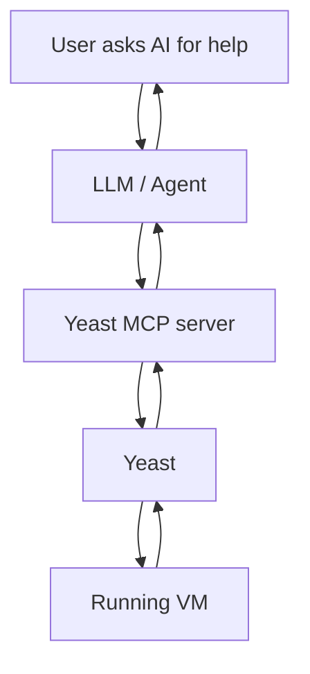

The AI should not invent direct VM access. It should use Yeast MCP, and Yeast MCP should use stable Yeast commands and JSON responses.

### Yeast v2.0: Cloud And Remote Future

Goal: extend the Yeast model beyond one local machine.

This is the future Twarga Cloud direction. Do not build this too early.

Features:

- Remote Yeast workers: runs Yeast on another machine instead of only local.
- Twarga Cloud integration: powers paid hosted labs and infrastructure.
- Worker agent mode: lets cloud servers receive and run Yeast jobs.
- Web API daemon: allows web apps to control Yeast directly.
- Multi-user support: lets teams or classes use shared infrastructure.
- Remote lab execution: runs labs for users who do not want local setup.
- Hosted LabsBackery backend: makes LabsBackery usable from a browser.
- Provider abstraction: prepares Yeast for other backends later.
- Optional libvirt backend: gives advanced Linux users another runtime path.
- Cloud-managed images and templates: centralizes official images and lab templates.

User value:

Users who like the workflow but do not want local setup can pay for hosted convenience.

Business value:

This is the Supabase-style model: open-source local engine, paid hosted ecosystem.

Success criteria:

- A hosted worker can run a lab for a remote user.
- LabsBackery can connect users to remote lab machines.
- Resource isolation and cleanup are reliable.

Risks:

- Cloud adds security, cost, billing, abuse, and operations problems.
- Remote workers require much stronger isolation.
- This can distract from making local Yeast excellent.

## 12. Prioritization Logic

The roadmap is ordered by dependency, not excitement.

The dependency chain is:

- Reliable lifecycle before provisioning.
- Project safety before large adoption.
- Provisioning before reusable labs.
- Snapshots before serious cybersecurity training.
- Networking before multi-VM labs.
- Guest control before Yeast MCP.
- Stable JSON before LabsBackery integration.
- Local proof before cloud hosting.

The most dangerous mistake would be building the cloud or AI layer before the VM engine is stable. That would create a shiny product on a weak foundation.

## 13. Tasks By Phase

### v0.1 Tasks

- Confirm current lifecycle commands are reliable.
- Improve docs for install, doctor, pull, up, ssh, down, destroy.
- Make status reconciliation trustworthy.
- Make image pull and checksum errors clear.
- Add small tests around command behavior where possible.
- Create one official quickstart demo.

### v0.2 Tasks

- Design project identity model.
- Move runtime paths under project-specific directories.
- Design state v2 schema.
- Add migration path from old state if needed.
- Split command workflow logic into application services.
- Define runtime interface.
- Improve error structure.

### v0.3 Tasks

- Design provisioning config.
- Decide which provisioning runs in cloud-init and which runs after SSH.
- Add package provisioning.
- Add shell provisioning.
- Add file provisioning.
- Add provisioning logs.
- Add `provision` command.
- Add failure and retry behavior.

### v0.4 Tasks

- Choose snapshot strategy.
- Define snapshot metadata.
- Add snapshot command.
- Add restore command.
- Add list/delete snapshot commands.
- Add safe behavior for running VMs.
- Test clean baseline workflow.

### v0.5 Tasks

- Design network config model.
- Define management network vs lab network.
- Add private network support.
- Add static IP support.
- Add validation.
- Add network info to status.
- Test two-VM lab.

### v0.6 Tasks

- Add exec command.
- Add copy upload.
- Add copy download.
- Add logs command.
- Add inspect command.
- Add structured command results.
- Add guest operation timeouts.

### v0.7 Tasks

- Design template folder structure.
- Add local template support.
- Add metadata.
- Add variables if needed.
- Add example templates.
- Add docs for creating templates.

### v0.8 Tasks

- Define JSON schema versions.
- Define standard error codes.
- Define lifecycle event names.
- Make human and JSON output render from events.
- Document compatibility guarantees.

### v0.9 Tasks

- Build one real LabsBackery lab using Yeast.
- Validate start, provision, snapshot, reset, status, and destroy.
- Add missing features found by integration.
- Document LabsBackery integration contract.

### v1.0 Tasks

- Freeze core commands.
- Freeze v1 config schema.
- Freeze JSON schemas.
- Write complete docs.
- Add example projects.
- Add release notes.
- Add known limitations.
- Prepare public release.

## 14. Questions Founder/PM Must Answer

### Product Identity Questions

Question: Is Yeast mainly a Vagrant replacement or a TwargaOps infrastructure engine?

Recommended answer: It is both, but the deeper identity is TwargaOps infrastructure engine. Vagrant alternative is the market explanation. Infrastructure engine is the product truth.

Question: Is Yeast for everyone or Linux-first users?

Recommended answer: Linux-first. Trying to support everything early will slow the project and weaken the core.

Question: Should Yeast support VirtualBox?

Recommended answer: Not in v1. QEMU/KVM-first is cleaner and aligned with Linux. Provider abstraction can come later.

Question: Should Yeast become a daemon?

Recommended answer: Not early. CLI-first is simpler. A daemon or API can come when LabsBackery or Twarga Cloud needs it.

### User Questions

Question: Who is the first real user?

Recommended answer: You, as a Linux builder and LabsBackery creator. Then other Linux users who want simple local VMs.

Question: What is the first external user workflow to optimize?

Recommended answer: Create one Ubuntu VM, provision Caddy, SSH into it, snapshot it, reset it.

Question: What user should Yeast ignore for now?

Recommended answer: Users who need polished cross-platform desktop support or enterprise hypervisor management.

### Business Questions

Question: How does Yeast make money if it is open source?

Recommended answer: Yeast builds trust and adoption. Money comes from LabsBackery courses, Twarga Academy, consulting, support, and Twarga Cloud hosted convenience.

Question: Should Yeast have paid features?

Recommended answer: Not initially. Keep core open. Monetize the ecosystem and hosting.

Question: What is the proof that Yeast matters?

Recommended answer: A full LabsBackery lab running on Yeast instead of Vagrant.

### Technical Product Questions

Question: What must be stable before LabsBackery depends on Yeast?

Recommended answer: Lifecycle, JSON status, provisioning, snapshots, private networking, and guest control.

Question: What must be stable before Yeast MCP depends on Yeast?

Recommended answer: Exec, copy, logs, inspect, stable JSON, stable error codes.

Question: What must be stable before Twarga Cloud depends on Yeast?

Recommended answer: Worker isolation, cleanup, remote control, resource limits, security model, and stable API.

### Scope Questions

Question: What is out of scope for v1?

Recommended answer: Full cloud platform, multi-user SaaS, Windows host support, VirtualBox backend, full GUI, billing, team management, enterprise RBAC.

Question: What is non-negotiable for v1?

Recommended answer: Reliable local lifecycle, provisioning, snapshots/reset, multi-VM networking, guest control, stable JSON, good docs.

Question: What should be delayed even if it is exciting?

Recommended answer: Twarga Cloud, advanced AI automation, provider ecosystem, plugin marketplace.

## 15. Success Metrics

### Product Metrics

- Time from install to first running VM.
- Percentage of users who complete first `up` successfully.
- Time to SSH readiness.
- Number of successful starts without manual intervention.
- Number of successful snapshot and restore cycles.
- Number of example labs that run end-to-end.

### Developer Experience Metrics

- Number of commands needed for first VM.
- Quality of error messages from doctor and up.
- Number of docs pages needed to complete quickstart.
- Number of GitHub issues caused by unclear setup.

### Ecosystem Metrics

- LabsBackery can start a lab using Yeast.
- LabsBackery can reset a lab using Yeast.
- Yeast MCP can run commands through Yeast.
- Twarga Academy can publish a course using Yeast labs.

## 16. Risks And Mitigations

Risk: Yeast becomes too broad.

Mitigation: Keep v1 Linux-first, QEMU/KVM-first, CLI-first.

Risk: Architecture rewrite delays visible progress.

Mitigation: Tie architecture work to project safety and provisioning. Do not refactor without user-facing benefit.

Risk: Provisioning becomes a weak Ansible clone.

Mitigation: Support simple packages, files, and shell. Integrate Ansible later only if needed.

Risk: Networking becomes too complex.

Mitigation: Start with simple private networks and management networking. Bridge and advanced modes can mature later.

Risk: Snapshots corrupt data.

Mitigation: Be conservative. Stop VMs before restore. Document behavior clearly.

Risk: JSON schemas change too often.

Mitigation: Version schemas before LabsBackery and MCP depend heavily on them.

Risk: Cloud distracts from local engine.

Mitigation: Do not start Twarga Cloud implementation until Yeast powers one real LabsBackery lab.

## 17. Documentation Plan

Yeast needs documentation for different readers.

### Beginner Docs

- What is Yeast?
- Why use Yeast instead of Vagrant?
- Install Yeast.
- Run doctor.
- Create first VM.
- SSH into VM.
- Stop and destroy VM.

### Builder Docs

- Yeast config reference.
- Provisioning guide.
- Multi-VM guide.
- Networking guide.
- Snapshots and reset guide.
- Templates guide.

### Integrator Docs

- JSON output schemas.
- Error codes.
- Events.
- LabsBackery integration contract.
- Yeast MCP integration contract.

### Maintainer Docs

- Architecture overview.
- State model.
- Runtime model.
- Provisioning model.
- Snapshot model.
- Release process.

## 18. Example Product Story

A user wants to build a small web app environment. They create a project and ask Yeast for an Ubuntu VM with Caddy installed. Yeast downloads the trusted Ubuntu image, creates a writable disk, generates cloud-init, boots QEMU/KVM, waits for SSH, installs Caddy, writes the app files, starts the service, and reports that the machine is ready.

Later, the user takes a snapshot called clean. They experiment and break the machine. Instead of rebuilding everything, they restore clean and continue.

Then the same model grows into LabsBackery. A lab template defines an attacker VM and a target VM on a private network. Yeast starts both, provisions the target app, snapshots the clean baseline, and exposes status to LabsBackery. A student can open a browser terminal, attack the target, break it, and reset it.

Then Yeast MCP enters. An AI agent can inspect the target VM, run commands, read logs, and explain why a service failed.

Then Twarga Cloud enters later. The same lab runs on a remote Yeast worker. The open-source engine remains free, and users pay for hosted convenience, courses, support, and managed infrastructure.

That is the full ecosystem story.

## 19. Final Scope Statement

Yeast starts as a Linux-first local VM orchestrator, but the full scope is to become the infrastructure engine for TwargaOps. It reads project configs, manages QEMU/KVM machines, provisions them with cloud-init and scripts, connects multiple VMs for labs, snapshots and resets environments, exposes guest control commands, and provides stable JSON and events so LabsBackery, Yeast MCP, and Twarga Cloud can build on top of it.

## 20. Next Recommended Work

The next best work is not to add every feature at once. The next best work is to make the foundation strong enough for provisioning.

Recommended next sequence:

1. Finish and verify current lifecycle.
2. Add project identity and project-safe paths.
3. Restructure internals around application services.
4. Design v1 Yeast config shape.
5. Add provisioning.
6. Create one Caddy web VM demo.
7. Add snapshot/reset.
8. Create one two-VM lab demo.
9. Use that demo as the first LabsBackery integration target.

If Yeast can run one real lab cleanly, the vision becomes real.
