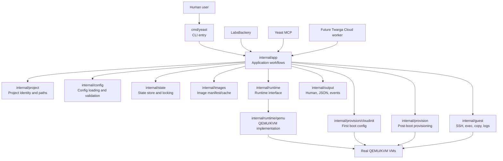
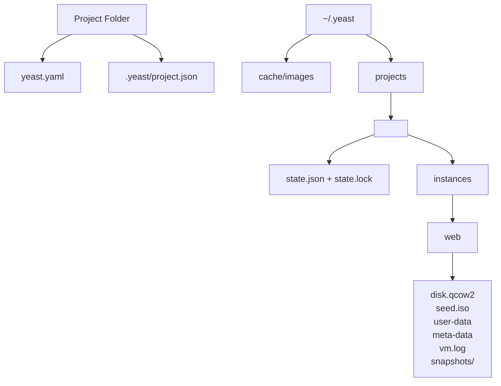
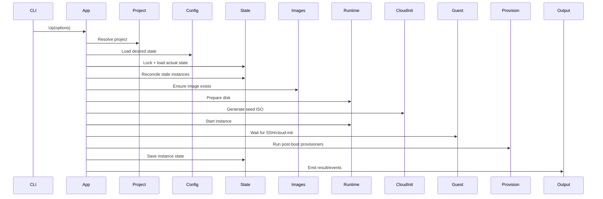
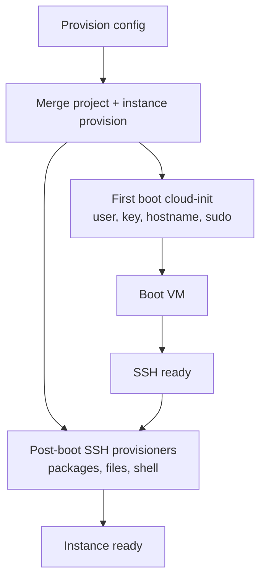
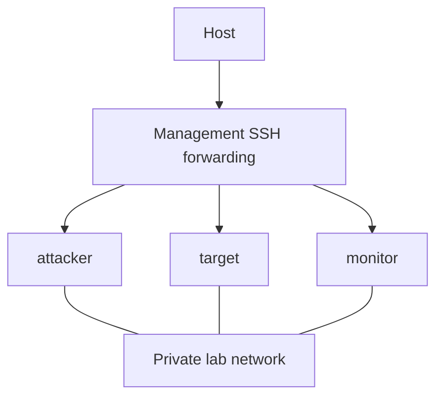
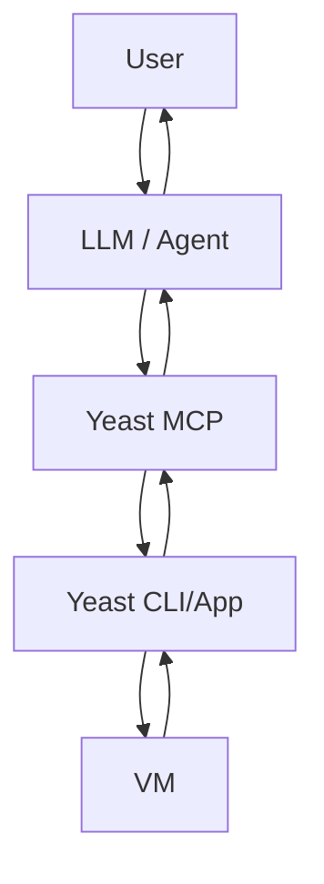

# Yeast Technical Architecture

Status: Draft v1  
Owner: Twarga / TwargaOps  
Phase: 6 - Architecture  
Purpose: Define how Yeast v2 should be structured internally before implementation

## 1. Architecture Goal

Yeast v2 should be built as a small but serious local infrastructure engine.

The architecture must support the product direction:

- local Linux-first VM lifecycle
- project-safe state
- direct QEMU/KVM runtime
- cloud-init guest preparation
- post-boot provisioning
- future snapshots/reset
- future multi-VM lab networking
- future guest control commands
- stable JSON/events for LabsBackery and Yeast MCP
- future remote worker mode without rewriting the core

The architecture should avoid the main MVP problem:

> CLI commands should not own the whole product logic.

In v2, commands should be thin. The real workflows should live in an application layer that can later be reused by LabsBackery integration, Yeast MCP, or a future worker mode.

## 2. Architecture Principles

### Principle 1: CLI Is An Entry Point, Not The Product

The CLI receives user input and prints output. It should not know QEMU internals, state file details, or provisioning logic.

### Principle 2: Application Layer Owns Workflows

Operations like `up`, `down`, `status`, `destroy`, `provision`, `snapshot`, `restore`, and `exec` are application workflows. They coordinate lower layers.

### Principle 3: Runtime Is Replaceable

Yeast v1 should use direct QEMU/KVM, but the rest of the system should not depend directly on QEMU command construction.

The runtime boundary should make future libvirt or remote worker backends possible.

### Principle 4: Config Is Desired State

`yeast.yaml` describes what the user wants.

It should not store runtime details like PID, SSH port, boot status, or last provisioning error.

### Principle 5: State Is Actual Runtime Reality

State records what Yeast believes actually exists.

State should be reconciled with real process/disk reality before important operations.

### Principle 6: Human Output And JSON Output Come From Same Events

Yeast should not implement two separate workflows for humans and tools.

Workflows emit events and results. Human output and JSON output render those events differently.

### Principle 7: LabsBackery Should Not Know QEMU

LabsBackery should call Yeast through a stable interface. It should not start QEMU, parse VM folders, or invent its own state model.

## 3. High-Level System Diagram



## 4. Recommended Folder Structure

```text
cmd/
  yeast/
    main.go
    root.go
    init.go
    doctor.go
    pull.go
    up.go
    status.go
    ssh.go
    down.go
    destroy.go
    provision.go
    snapshot.go
    restore.go
    exec.go
    copy.go
    logs.go

internal/
  app/
    service.go
    up.go
    down.go
    status.go
    destroy.go
    provision.go
    snapshot.go
    restore.go
    exec.go
    results.go
    errors.go

  project/
    project.go
    identity.go
    paths.go

  config/
    model.go
    loader.go
    validate.go
    defaults.go

  state/
    model.go
    store.go
    lock.go
    reconcile.go
    migrations.go

  images/
    manifest.go
    cache.go
    downloader.go
    verify.go

  runtime/
    runtime.go
    model.go
    qemu/
      runtime.go
      command.go
      disk.go
      process.go
      network.go
      snapshot.go

  provision/
    model.go
    provisioner.go
    cloudinit/
      user_data.go
      meta_data.go
      iso.go
    ssh/
      packages.go
      files.go
      shell.go

  guest/
    client.go
    ssh.go
    exec.go
    copy.go
    logs.go
    readiness.go

  output/
    events.go
    human.go
    json.go
    schemas.go

  util/
    size.go
    ports.go
    process.go
    paths.go

docs/
  quickstart.md
  config-reference.md
  architecture.md
  troubleshooting.md

examples/
  ubuntu-basic/
  caddy-web/
  two-vm-lab/
```

This structure separates product workflows from technical implementation details. It also keeps future LabsBackery/MCP integration possible because the application layer is not trapped inside Cobra command files.

## 5. Layer Responsibilities

## 5.1 CLI Layer

Package:

```text
cmd/yeast
```

Responsibilities:

- parse command arguments
- parse flags
- create application service
- call application workflow
- choose human or JSON output mode
- return exit codes

Must not own:

- QEMU command construction
- state mutation details
- provisioning execution
- image download internals
- business workflow logic

Example mental model:

```text
yeast up
  -> parse flags
  -> app.Up(ctx, options)
  -> output.Render(result/events)
```

## 5.2 Application Layer

Package:

```text
internal/app
```

Responsibilities:

- own product workflows
- coordinate config, state, images, runtime, provisioning, guest, output
- enforce operation order
- produce structured results
- emit events
- map low-level errors to product errors

Main workflows:

- `Init`
- `Doctor`
- `Pull`
- `Up`
- `Status`
- `SSH`
- `Down`
- `Destroy`
- `Provision`
- `Snapshot`
- `Restore`
- `Exec`
- `Copy`
- `Logs`

The application layer is the heart of Yeast.

## 5.3 Project Layer

Package:

```text
internal/project
```

Responsibilities:

- discover project root
- create project identity
- load project identity
- calculate project runtime paths
- prevent instance name/path collisions

Project identity should be stable even if a project folder moves.

Recommended project metadata:

```text
.yeast/project.json
```

Recommended contents:

```json
{
  "schema": "yeast.project.v1",
  "id": "proj_abc123",
  "created_at": "2026-05-16T12:00:00Z"
}
```

Question for implementation:

Should `.yeast/project.json` be committed?

Recommended answer:

No by default. It is runtime identity metadata. But this needs documentation because project identity affects runtime folder paths.

## 5.4 Config Layer

Package:

```text
internal/config
```

Responsibilities:

- load `yeast.yaml`
- validate config
- apply defaults
- normalize values
- return desired state model

Config describes desired state.

It should include:

- version
- project name eventually
- instances
- images
- resources
- disk size
- user
- sudo policy
- networks
- provisioning
- templates later

Config should not include:

- PID
- SSH port chosen at runtime
- process status
- provisioning last error
- snapshot runtime metadata

## 5.5 State Layer

Package:

```text
internal/state
```

Responsibilities:

- load state
- lock state
- save state atomically
- migrate old state
- reconcile stale process state
- store actual runtime facts

Recommended state file:

```text
~/.yeast/projects/<project-id>/state.json
```

State should include:

- schema version
- project ID
- instance runtime map
- PID
- status
- management IP
- SSH port
- instance directory
- provisioning status
- snapshot metadata later
- last error summary

State should be JSON for v1.

Reason:

- simple
- inspectable
- enough for local project state
- easy to debug

SQLite can be considered later for cloud/daemon/multi-user scenarios.

## 5.6 Image Layer

Package:

```text
internal/images
```

Responsibilities:

- list supported images
- resolve trusted image names
- download images
- verify checksums
- manage cache paths
- avoid corrupt partial downloads

Recommended cache layout:

```text
~/.yeast/cache/images/
  ubuntu-24.04/
    image.qcow2
    manifest.json
```

v1 should use a built-in trusted manifest first.

Remote manifests can come later.

## 5.7 Runtime Layer

Package:

```text
internal/runtime
internal/runtime/qemu
```

Responsibilities:

- define runtime interface
- prepare disks
- start VM process
- stop VM process
- destroy runtime files
- manage QEMU process lifecycle
- build QEMU command arguments
- manage runtime networking
- support snapshots later

The application layer should depend on runtime interfaces, not direct QEMU implementation details.

v1 backend:

```text
direct QEMU/KVM
```

Future backend:

```text
libvirt
remote worker
```

## 5.8 Provisioning Layer

Package:

```text
internal/provision
internal/provision/cloudinit
internal/provision/ssh
```

Responsibilities:

- generate cloud-init user-data
- generate cloud-init meta-data
- create seed ISO
- build merged provisioning plans from project and instance config
- run post-boot package/file/shell provisioners over SSH
- track provisioning steps
- report provisioning errors

Provisioning has two phases:

```text
first boot cloud-init
post-boot SSH provisioning
```

v1 provisioners:

- packages
- files
- shell

v0.3 rule:

```text
cloud-init remains bootstrap.
packages, files, and shell run post-boot over SSH.
```

Cloud-init owns the bootstrap surface:

- Linux user
- SSH authorized key
- hostname
- sudo policy
- environment/profile bootstrap
- seed ISO generation

Post-boot SSH provisioning owns the mutable setup surface:

- package installation
- file upload
- permission application
- shell command execution
- service start/restart commands

Project-level and instance-level provisioning merge by appending lists in this order:

```text
project packages -> instance packages
project files    -> instance files
project shell    -> instance shell
```

`yeast up` runs the merged post-boot provisioning plan automatically after SSH readiness.

`yeast provision` reruns the same merged post-boot provisioning plan against an existing reachable VM. It does not recreate disks, regenerate cloud-init, or restart the VM unless a user-authored shell command does that.

Idempotency rules:

- package installation should rely on the guest package manager's normal idempotency
- file provisioning overwrites destination files
- shell commands always run and must be written as idempotent by the user

Do not start with Ansible. Add it later only if needed.

## 5.9 Guest Control Layer

Package:

```text
internal/guest
```

Responsibilities:

- wait for SSH readiness
- execute commands
- copy files up/down
- collect logs
- inspect guest state
- provide structured command results

v1 transport:

```text
SSH
```

Future transport:

```text
guest agent, only if needed
```

## 5.10 Output Layer

Package:

```text
internal/output
```

Responsibilities:

- define event types
- render human output
- render JSON output
- standardize error shape
- version schemas
- keep terminal styling isolated from application workflows

Output should be driven by events and results from application workflows.

Important rule:

Human output and JSON output must not require separate workflow logic.

Charm libraries belong in this layer or a future `internal/ui` layer. Lip Gloss can style human output. Glamour can render Markdown docs. Bubble Tea and Bubbles can render live progress after Yeast has lifecycle events. These libraries must not leak ANSI styling into JSON output.

## 6. Project Storage Architecture

Recommended storage layout:

```text
project-folder/
  yeast.yaml
  .yeast/
    project.json

~/.yeast/
  cache/
    images/
      ubuntu-24.04/
        image.qcow2
        manifest.json

  projects/
    <project-id>/
      state.json
      state.lock
      instances/
        web/
          disk.qcow2
          seed.iso
          user-data
          meta-data
          vm.log
          snapshots/
        db/
          disk.qcow2
          seed.iso
          user-data
          meta-data
          vm.log
          snapshots/
```

## 7. Storage Diagram



## 8. Config Model

The v2 config should be designed around project-based desired state.

Conceptual fields:

```text
version
project
images
networks
instances
```

Instance desired fields:

```text
name
image
memory
cpus
disk_size
user
sudo
networks
provision
user_data
```

Provision desired fields:

```text
packages
files
shell
```

Important config rules:

- config version must be explicit
- names must be path-safe
- defaults must be predictable
- invalid config should fail before runtime work starts
- provisioning should be structured before allowing full custom scripts everywhere
- top-level provision steps apply to every instance
- instance provision steps append after top-level steps

## 9. State Model

State is actual runtime reality.

Conceptual state:

```text
schema
project_id
instances
```

Instance state:

```text
name
status
pid
management_ip
ssh_port
runtime_dir
disk_path
provisioning_status
last_started_at
last_stopped_at
last_error
snapshots
```

Possible statuses:

```text
absent
prepared
starting
running
provisioning
ready
stopped
error
```

Readiness levels:

```text
process_running
ssh_ready
cloud_init_complete
provisioned
ready
```

The status model should avoid lying.

A QEMU process running does not mean the VM is ready.

## 10. Runtime Model

The runtime interface should expose VM operations without leaking QEMU details to the application layer.

Runtime responsibilities:

- prepare instance disk
- prepare runtime files
- start instance
- stop instance
- inspect process
- destroy instance runtime
- snapshot instance later
- restore instance later

Runtime should receive a fully resolved machine plan from the application layer.

The runtime should not parse `yeast.yaml`.

The runtime should not print output directly.

The runtime should return structured results and errors.

## 11. `yeast up` Flow



## 12. `yeast status` Flow

`status` should never blindly print state.

Flow:

```text
resolve project
lock/load state
reconcile running processes
check each tracked instance
save reconciled state if changed
render human or JSON status
```

The user should be able to trust status.

## 13. `yeast destroy` Flow

Destroy should be conservative.

Flow:

```text
resolve project
lock/load state
for each target instance:
  if running, stop first
  remove runtime directory
  remove state entry
save state
render result
```

Destroy should not remove shared cached images.

Destroy should not remove unrelated project directories.

## 14. Provisioning Architecture

Provisioning should be split into two clear phases.



Cloud-init owns:

- user
- SSH key
- hostname
- sudo policy

Post-boot provisioning owns:

- installing packages
- copying local project files
- running shell commands
- restarting services
- verifying services

Merge order:

```text
project packages -> instance packages
project files    -> instance files
project shell    -> instance shell
```

Automatic run:

- `yeast up` runs provisioning after SSH readiness.
- A VM is not considered fully ready until provisioning finishes or fails.

Manual rerun:

- `yeast provision` requires an existing reachable VM.
- It reruns the same post-boot plan.
- It does not recreate the VM.
- It does not mutate first-boot cloud-init data.

Provisioning result should be stored in state:

```text
not_started
running
provisioned
failed
```

## 15. Networking Architecture

v0.1/v0.2 networking:

```text
QEMU user networking + SSH host port forwarding
```

Purpose:

- simple management access
- no root network setup
- reliable beginner workflow

v0.5 networking:

```text
management network + private lab network
```

Management network:

- Yeast controls the VM
- SSH port forwarding
- host to guest

Lab network:

- VM to VM
- static IPs
- used for LabsBackery exercises

Diagram:



Architecture rule:

Do not mix management access and lab traffic conceptually.

## 16. Snapshot Architecture

Snapshot model is not final until experiments are complete.

Architecture must allow:

- create snapshot
- list snapshots
- restore snapshot
- delete snapshot
- snapshot all instances
- restore all instances

Safety rule:

Early snapshot/restore should require stopped VMs.

Reason:

Disk safety matters more than clever live restore.

Snapshot metadata should belong in state or a snapshot metadata file under the instance directory.

Possible snapshot state:

```text
name
created_at
disk_reference
description
status
```

## 17. Guest Control Architecture

Guest control should use SSH first.

Operations:

- wait for SSH
- exec command
- copy file to guest
- copy file from guest
- read VM log
- inspect guest later

Exec result should include:

```text
command
exit_code
stdout
stderr
started_at
finished_at
duration
timed_out
```

This is critical for Yeast MCP.

## 18. Output And Events Architecture

Application workflows should emit events.

Events should be usable by:

- human terminal renderer
- JSON renderer
- future LabsBackery progress UI
- future MCP responses

Event shape:

```text
schema
type
timestamp
project_id
instance
level
message
data
```

Example event types:

```text
project.resolved
config.loaded
state.locked
state.reconciled
image.verified
disk.prepared
cloudinit.generated
instance.starting
instance.started
guest.ssh_ready
provision.started
provision.finished
state.saved
command.finished
```

Error shape:

```text
schema
command
ok
error.code
error.message
error.details
```

Important rule:

Human output is presentation. JSON output is contract.

## 19. LabsBackery Integration Architecture

Early integration:

```text
LabsBackery -> Yeast CLI --json -> Yeast app workflows
```

Why:

- simplest integration
- language-independent
- forces stable JSON
- no daemon security problem early

LabsBackery should use:

- `yeast up --json`
- `yeast status --json`
- `yeast down --json`
- `yeast destroy --json`
- future `yeast snapshot --json`
- future `yeast restore --json`
- future `yeast exec --json`

Future integration:

```text
LabsBackery -> Yeast daemon/API
```

Only build this when CLI/JSON becomes limiting.

## 20. Yeast MCP Integration Architecture

Yeast MCP should sit above Yeast.



Yeast must provide safe primitives:

- status
- exec
- copy
- logs
- inspect
- snapshot
- restore

MCP should decide:

- what requires approval
- how much output to return
- which operations are destructive
- how to prevent unsafe command chains

Yeast should expose enough structure for MCP to be safe.

## 21. Error Handling Architecture

Errors should be product-level, not raw random strings.

Examples:

```text
config.load_failed
config.invalid
state.lock_failed
state.corrupt
image.not_found
image.checksum_failed
runtime.qemu_not_found
runtime.start_failed
guest.ssh_timeout
provision.failed
snapshot.unsupported
network.invalid
```

Each error should have:

- code
- human message
- optional details
- suggested fix when possible

This helps:

- terminal users
- LabsBackery
- Yeast MCP
- future docs

## 22. Security Architecture

Local v1 security rules:

- validate instance names
- validate network names
- validate file provisioning paths
- avoid path traversal
- avoid shell string interpolation when possible
- use explicit command argument arrays
- set safe permissions on generated files
- never destroy paths outside project runtime directory
- make destructive commands explicit

Trust model:

Local Yeast config is trusted by the user running it.

But Yeast should still prevent accidental host damage.

Cloud trust model is separate and much stricter.

Do not design Twarga Cloud security from local assumptions.

## 23. Testing Architecture

Test layers:

- config unit tests
- state unit tests
- path safety tests
- image verification tests
- runtime command construction tests
- provisioning generation tests
- output schema tests
- integration tests with real QEMU when available
- manual VM lifecycle checklist

Important:

Some Yeast behavior cannot be fully tested without KVM/QEMU on a real Linux host.

So tests should split into:

```text
fast tests
integration tests
host-dependent tests
manual release checklist
```

## 24. Migration From Current Code

Current code should be treated as prototype/reference.

Reusable ideas:

- Cobra CLI command names
- image downloader/checksum logic
- config validation patterns
- size parsing utilities
- file lock concept
- QEMU command knowledge
- cloud-init generation knowledge
- SSH readiness concept
- human/JSON output idea

Do not blindly copy:

- command files that own too much workflow logic
- instance path model based only on name
- state model without project identity
- provisioning behavior before redesign

Migration approach:

```text
study old code
extract reusable concepts
write v2 architecture
implement clean v2 modules
port small utilities only when understood
```

## 25. Architecture Decisions

Decision 1:

Use Go.

Reason:

Good fit for CLI, systems work, static binaries, QEMU process control.

Decision 2:

Use direct QEMU/KVM for v1.

Reason:

Simpler dependency model and stronger founder understanding.

Decision 3:

Use YAML config.

Reason:

Readable for infrastructure projects and familiar to target users.

Decision 4:

Use JSON state for v1.

Reason:

Inspectable, simple, enough for local project state.

Decision 5:

Use project metadata file for stable project ID.

Reason:

Prevents VM name collisions and survives folder moves better than path hash.

Decision 6:

Use SSH for guest control in v1.

Reason:

Standard, understandable, no guest agent complexity.

Decision 7:

Use CLI + JSON for LabsBackery integration first.

Reason:

Simple, language-independent, avoids daemon complexity.

Decision 8:

Delay daemon/API until need is proven.

Reason:

Daemon adds security and lifecycle complexity too early.

## 26. Open Architecture Questions

These need experiments or deeper design before implementation:

- final snapshot model
- private networking implementation
- exact project metadata behavior
- exact config v2 schema
- cloud-init completion detection
- event streaming format
- whether `yeast provision` should be automatic or manual by default
- whether state should store runtime paths or derive them
- whether `.yeast/project.json` should be created by `init` only or lazily

## 27. Architecture Summary

Yeast v2 should be structured as:

```text
CLI
  -> Application workflows
    -> Project
    -> Config
    -> State
    -> Images
    -> Runtime
      -> QEMU
    -> Provisioning
      -> Cloud-init
      -> SSH provisioners
    -> Guest control
    -> Output/events
```

The most important architecture decision is separation:

- CLI does not own workflows.
- Runtime does not parse config.
- State does not become config.
- LabsBackery does not know QEMU.
- MCP does not bypass Yeast.
- Cloud waits until local engine is strong.

## 28. Next File

After architecture, create:

```text
YEAST_V2_IMPLEMENTATION_PLAN.md
```

That file should turn this architecture into milestones, epics, tasks, and definitions of done.

Implementation should not begin seriously until that plan exists.
